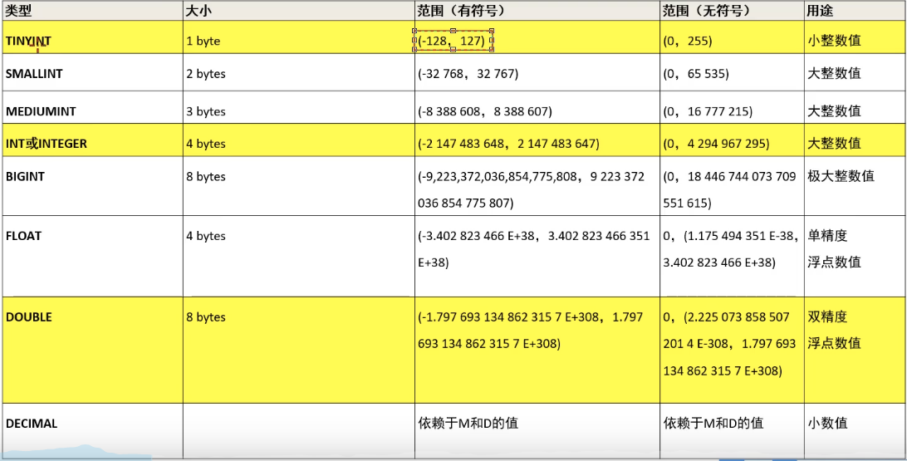
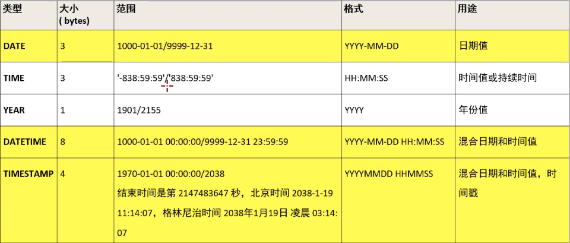
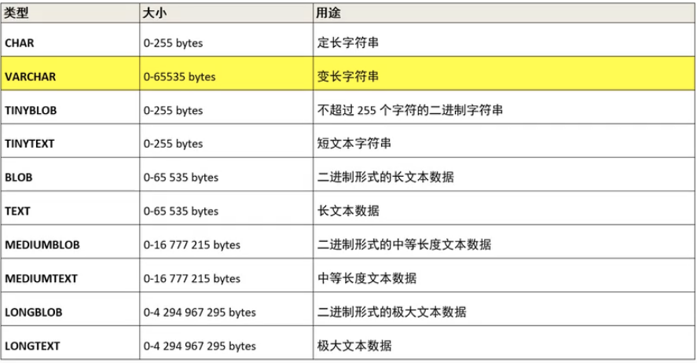

##  mysql数据库基本操作-DDL

1. DDL:

   DDL(data definition language), 数据定义语言，该语言包括以下内容

   - 对数据库地常用操作
   - 对表结构的常用操作
   - 修改表结构

## (1) 对数据库的常用操作

| 功能                           | sql                                                      |
| ------------------------------ | -------------------------------------------------------- |
| **查看所有的数据库**           | **show database**                                        |
| **创建数据库**                 | **create database [if not exists] mydb1 [charset=utf8]** |
| **切换（选择要操作的）数据库** | **use mydb1;**                                           |
| **删除数据库**                 | **drop database [if exists] mydb1;**                     |
| 修改数据库编码                 | alter database mydb1 character set utf8;                 |
|                                |                                                          |

```sql
-- 1、DDL-数据库操作
# 查看所有数据库
show DATABASES;

# 创建数据库
create DATABASE mydb1;
create DATABASE if NOT EXISTS mydb1;

# 选择使用哪一个数据库
use mydb1;
# 删除数据库 
drop database mydb1;
drop DATABASE if EXISTS mydb1;

# 修改数据库编码 
ALTER DATABASE test CHARACTER set utf8;
```


## (2) 对表结构的常用操作 - 创建表

###  1.创建表格式

create table [if not exists] 表名 （

​	字段名1 类型[(宽度)] [约束条件] [commnet ‘字段说明’],

​	字段名2 类型[(宽度)] [约束条件] [commnet ‘字段说明’],

​	字段名3 类型[(宽度)] [约束条件] [commnet ‘字段说明’],

）[表的一些设置];

> 创建表是构建一张空表，指定这个表的名字，这个表有几列， 每一列叫什名字， 以及每一列存储的数据类型。

```sql
use mydb1;
create table if not exists student(
	sid int,
  name varchar(20),
  gender varchar(20),
  age int,
  brith date,
  address varchar(20)
);
```


### 2.数据类型

数据类型是指在创建表的时候为表中字段指定数据类型，只有数据符合类型要求才能存储起来，使用数据类型的原则是： *够用就行，尽量使用取值范围小的，而不用大的*，这样可以更多的节省存储空间。

>- *数值类型*
>
>
>
>`decimal(M,D) --> decimal(5,2) #有效位5， 保留2位小数`
>
>

>-  *日期和时间类型*
>- 
>
>

>- *字符串类型*
>- 
>- 用法`varchar(20)`，最多存20个，填写不超过20字符，也不会浪费空间， 有多少存多少


### 3.对表结构的常用操作 -- 其他操作

| 功能                             | sql                         |
| -------------------------------- | --------------------------- |
| **查看当前数据库的所有表的名称** | **show tables;**            |
| **查看指定某个表的创建语句**     | **show create table 表名;** |
| **查看表结构**                   | **desc 表名**               |
| *删除表*                         | **drop table 表名**         |

```sql
-- 3. 查看当前数据库所有的表 
show tables;

-- 4. 查看指定表的创建语句 
show CREATE TABLE student;


-- 5. 查看表结构, 每一列的情况  
desc student;

-- 6.  删除表 
drop TABLE student;

```


## (3) 修改表结构格式

###  1.修改表-添加列

- 语法格式：

  > alter table 表名 add 列名 类型（长度） [约束];

  - 例子：

    ```sql
    # 为student 表添加一个新的字段为： 系别 dept 类型为 varchar(20)
    
    alter TABLE student ADD dept VARCHAR(30);
    ```

### 2.修改列名和类型

- 语法格式：

  > alter table 表名 change 旧列名 新列名 类型（长度） [约束];

​	例子：

```sql
# 为student 表的dept字段更换为department varchar(35)

alter TABLE student change dept department VARCHAR(35);
```

### 3.修改表-删除列

- 语法格式：

  > alter table 表名 drop 列名;

​	例子：

```sql
# 删除student 表中department这一列；

alter table student drop department;
```

### 4.修改表名

- 语法格式：

  > rename table 表名 to 新表名;

​	例子：

```sql
# 将student 表改名为stu；

rename table student to stu;
```


```sql
-- 修改表结构 
-- 1. 添加列： alter table 表名 add 列名 类型（长度） [约束];
		-- # 为student 表添加一个新的字段为： 系别 dept 类型为 varchar(20)
use mydb1;
alter TABLE student ADD dept VARCHAR(30);
desc student;

-- 2. 修改列名和类型 
   -- alter table 表名 change 旧列名 新列名 类型（长度） [约束];
	 alter TABLE student change dept department VARCHAR(35);
	 
-- 3. 修改表-删除列
alter table student drop department;
desc student;


--  4.修改表名
	--  rename table 表名 to 新表名;
rename TABLE student to stu; 
```

