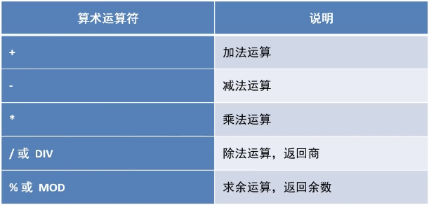

# MySQL 数据库基本操作-DQL-data query language基本查询

- ###  概念

  - 数据库管理系统一个重要功能就是数据查询，数据查询不应只是简单的返回数据库中存储的数据，还应该根据需要对数据进行筛选已经确定数据以什么样的格式显示。
  - mysql提供了功能强大、灵活的语句来实现这些操作。
  - mysql数据库使用**SELECT**语句来查询数据。

- ### 应用

- ### 语法格式

  >**select** 
  >
  >​	[all | distinct]
  >
  >​	<目标列的表达式1> [别名],
  >
  >​	<目标列的表达式1> [别名] ...
  >
  >**from**  <表名或者视图名> [别名], <表名或者视图名> [别名]...
  >
  >[**where** <条件表达式>]
  >
  >[group by <列名>
  >
  >[having <条件表达式>]]
  >
  >[order by <列名> [asc | desc]]
  >
  >[limit <数字或者列表> ];
  >
  >

- ###  简化版语法格式

  > select *| 列名 from 表 where 条件

## 数据准备

- ### 创建数据库和表

  > ```sql
  > -- 创建数据库
  > create database if not exists mydb2;
  > use mydb2;
  > 
  > -- 创建商品表：
  > create table product(
  >   pid int primary key auto_increment,  -- 商品编号，为主键，自增长
  >   pname varchar(20) not null, -- 商品名字，不为空
  >   price double, -- 商品价格
  >   category_id varchar(20) -- 商品所属分类
  > );
  > 
  > ```

- ### 添加数据：

  > ```sql
  > insert into product values (null, '海尔洗衣机', 5000, 'c001');
  > insert into product values (null, '美的冰箱', 3000, 'c001');
  > insert into product values (null, '格力空调', 5000, 'c001');
  > insert into product values (null, '九阳电饭煲', 5000, 'c001');
  > 
  > insert into product values (null, '啄木鸟衬衣', 300, 'c002');
  > insert into product values (null, '恒源祥西裤', 800, 'c002');
  > insert into product values (null, '花花公子夹克', 440, 'c002');
  > insert into product values (null, '劲霸休闲裤', 266, 'c002');
  > insert into product values (null, '海澜之家卫衣', 180, 'c002');
  > insert into product values (null, '杰克琼斯运动裤', 430, 'c002');
  > 
  > 
  > insert into product values (null, '兰蔻面霜', 300, 'c003');
  > insert into product values (null, '雅诗兰黛精华水', 200, 'c003');
  > insert into product values (null, '香奈儿香水', 350, 'c003');
  > insert into product values (null, 'sk-ii神仙水', 350, 'c003');
  > insert into product values (null, '资生堂粉底液', 180, 'c003');
  > 
  > insert into product values (null, '老北京方便面', 56, 'c004');
  > insert into product values (null, '良品铺子海带丝', 17, 'c004');
  > insert into product values (null, '三只松鼠坚果', 88, null);
  > 
  > 
  > ```

##  简单查询

> select 筛选查询的--字段（列）， from后面是要查询的表的名字


```sql

-- 简单查询 

-- 1，查询所有的商品 
SELECT pid,pname, price, category_id FROM product; 
SELECT * FROM product;

-- 2. 查询商品名和商品价格。
SELECT pname,price from product;

-- 3.别名查询，使用关键字是as (as 可以省略的) 
-- 3.1 表别名
SELECT * from product as p;
SELECT * from product p1;

# SELECT p.id, u.id from product as p, user as u;
# SELECT product.id, user.id from product, user;

-- 3.2 列别名
SELECT pname, price FROM product as p;

SELECT pname as '商品名', price as '商品价格' FROM product as p;


-- 4. 去掉重复值；
SELECT distinct price from product;  -- 去重复的列

SELECT distinct * FROM product; -- 如果某一行和另一行数据重复，可以去重 

-- 5.查询结构是表达式（运算查询）：将所有商品的加价10元之后显示；
SELECT pname, price+ 10 as new_price from product;


```


## 运算符 以及 运算符操作

### 简介：

​	数据库表结构确定之后，表中的数据代表的意义就已经确定了。

​	通过mysql运算符进行运算，就可以获取表结构以外的另一种数据。

​    例如：学生表中一个birth字段，表示学生出生年份。而运用mysql运算符用当前年份减去出生年份，就是学生实际年龄。

- mysql支持4种运算符：
  - 1.算数运算符
  - 2.比较运算符
  - 3.逻辑运算符
  - 4.位运算符

### 1.算数运算符

> 


```sql
--  1.算数运算符 
SELECT 6+2;
SELECT 6-2;
SELECT 6*2;
SELECT 6/2;
SELECT 6 mod 4;
SELECT 6%2;
-- 所有商品价格+10元 
SELECT pname, price + 10 new_price from product;
-- 商品价格上调10%；
SELECT pname, price *1.1 new_price from product;
```

### 2.比较运算符

> 

### 3.逻辑运算符

> 

> **注意**：
>
> 函数 ifnull (e1,e1)
>
> 如果e1 = null, 则返回e2, 否则直接返回e1本身

### ***运算符操作---条件查询 -- 逻辑运算符+逻辑运算符***


```sql
-- 2. 比较运算符 
-- 3.逻辑运算符 
 
-- 查询商品名称 “海尔洗衣机”的商品所有信息 
SELECT * from product where pname = '海尔洗衣机'; 

-- 查询价格为800的商品
SELECT * from product where price = 800;

-- 查询价格不是800的商品；
SELECT * from product where price != 800;
SELECT * from product where price <> 800;
SELECT * from product where not (price = 800);
 
-- 查询价格大于等于60的所有商品信息 
SELECT * from product where price >= 60;

-- 查询价格在200到1000的所有商品信息 
SELECT * from product where price BETWEEN 200 and 1000; # 包含200和1000
SELECT * from product where price >=200 and  price <=1000; # 包含200和1000
SELECT * from product where price >=200 &&  price <=1000; # 包含200和1000

-- 查询价格是200或800的所有商品信息 
SELECT * from product where price in(200,800);
SELECT * from product where price= 200 or price =800; 
SELECT * from product where price= 200 || price =800; 

-- 查询含有“鞋”字的所有商品 
SELECT * from product where pname Like '%鞋%'; -- 用来匹配任意字符
SELECT * from product where pname Like '%裤%';

-- 查询含有“海”字的所有商品 
SELECT * from product where pname Like '海%';

-- 查询第二个字为“蔻”的所有商品； 
SELECT * from product where pname like '_蔻%';   -- 一个下划线可以匹配单个字符（字母或者汉字） 

-- 查询category_id  为null 的商品 
SELECT * from product where category_id is null;
SELECT * from product where ISNULL(category_id);

-- 查询category_id  不为null 分类的商品  
SELECT * from product where category_id is not null;

-- 使用least 求最小值 
SELECT LEAST(10,20,30,10000);
SELECT LEAST(10,20,30,10000) as smallest_number;
SELECT LEAST(10,20,30,null);  -- 求最小值的有个值为null，不会比较，直接返回null

-- 使用greatest求最大值
SELECT greatest(10,20,30,10000);
SELECT greatest(10,20,30,10000) as g_number;
SELECT greatest(10,20,30,null); -- 求最大值的有个值为null，不会比较，直接返回null


```


### 4.位运算符

> 


```sql
-- 4.位运算符 
SELECT 3 & 5;   -- 位与
# 011
# 101

SELECT 3|5;  -- 位或

SELECT 3^5;  -- 位异或

SELECT 3>>1; -- 位右移1位 # 0011 >> 1  --> 0001

SELECT  3<<1; # 0011 <<1  --> 0110

SELECT ~3; --
```


##  排序查询 - order by

- **介绍：**

  - 如果需要对读取的数据进行排序，便可以使用mysql中order by子句来设定想要按哪个字段来进行排序，再返回搜索结果。

     

- **特点：**

  - 1.asc代表ascent升序，desc代表descent降序， 如果不写默认升序
  - 2.order by用于子句可以支持**单字段，多字段，表达式，函数，别名**
  - 3.order by子句，放在查询语句的最后面。 *LIMITI子句除外。*

- ### **操作**


```sql
-- 排序查询 
-- 1.使用价格排序（降序）
SELECT * FROM product order by price;

sELECT * FROM product order by price asc;
SELECT * FROM product order by price desc;

-- 2. 在价格排序（降序）的基础上，以分类排序（降序）, 主要条件+次要条件
SELECT * from product ORDER BY price desc, category_id desc; # 只有价格相同才会按照后面的字段降序排列

SELECT * from product ORDER BY category_id desc, price desc; # 只有类别相同，才会进行排序，


-- 3.显示商品的价格（去重复），并排序（降序）
SELECT DISTINCT price from product ORDER BY price desc;
```


## 聚合查询

- ### 简介

  ​	之前我们的查询都是横向查询，它们都是根据 条件一行一行的进行判断，而使用 *聚合函数查询是纵向查询*，它是对一列的值进行计算，然后返回一个单一的值；另外*聚合函数会**忽略空值***。


```sql
-- 聚合查询 
-- 1.求商品总条数 
SELECT COUNT(pid) FROM product;
SELECT COUNT(*) FROM product;  # 不为null行的总条数 

-- 2.查询价格大于200商品的总条数
SELECT COUNT(pid) FROM product where price >200;

-- 3.查询分类为 ‘c001’ 的所有商品的价格de总和
SELECT sum(price) from product WHERE category_id = 'c001';

-- 4.  查询商品的最大价格 
SELECT MAX(price) as max_price from product;

-- 5.  查询商品的最小价格 
SELECT min(price) as min_price from product;

-- 6.  查询商品的平均价格
SELECT avg(price) from product where category_id = 'c002';

```

###  聚合查询 -- NULL值的处理


```sql
CREATE TABLE if not EXISTS test_null(
c1 VARCHAR(20),
c2 int 

);

INSERT into test_null VALUES ('aaa',3);
INSERT into test_null VALUES ('bbb',3);
INSERT into test_null VALUES ('ccc',null);
INSERT into test_null VALUES ('ddd',6);

--  count(*) = count(1)
SELECT COUNT(*), count(1), count(c2) from test_null;

SELECT sum(c2), max(c2), min(c2), avg(c2) from test_null; # avg = 12/3, 忽略null 
```


## 分组查询-group by

- ### 简介

  分组查询是指使用group by 字句对查询信息进行分组。

  #### 格式：

  > select 字段1， 字段2， ... from 表名 group by 分组字段 having 分组条件;

  按照多字段分组，只有多字段都相同才能分组到同一组。

  #### 操作：

  ``` sql
  -- 1.统计各个分类商品的个数
  -- 分组查询 
  -- select 字段1， 字段2， ... from 表名 group by 分组字段 having 分组条件;
  -- 1. 统计各个分类商品的个数， group by 后面可以跟多个字段，
  -- 注意：分组之后，select后边只能写 分组字段 和聚合函数
  
  SELECT category_id,COUNT(pid) from product group by category_id;
  
  ```

  #### **注意：如果要进行分组的话，则select字句之后，只能出现分组的字段和统计函数，其他的字段不能出现**

  - ### 分组之后的条件筛选 - having

    - 1.分组之后对统计结果进行筛选的话必须使用having，不能使用where
    - 2.where子句用来筛选from子句中指定的操作所产生的行。
    - 3.group by 子句用来分组 where 子句的输出
    - 4.having 子句用来从分组的结构中筛选行。

  - #### 格式：

  - > select 字段1，字段2，... from 表名 group by 分组字段 having 分组条件;

  - ### 操作：

    ```sql
    --  2.统计各个分类商品的个数，且只显示个数大于4的信息
    SELECT category_id,COUNT(pid) from product group by category_id having COUNT(pid) > 4;
    
    SELECT 
    	category_id,COUNT(pid) as c 
    from 
    	product 
    group by 
    	category_id 
    having 
    	c > 4 
    order by 
    	c asc;
    ```

    

  ##  分页查询

  ### 简介：

  ​	分页查询在项目开发中常见，由于数据量很大，显示屏长度有限，因此对数据需要采用分页显示的方式。

  例如，数据共有30条，每页显示5条，第一页显示1-5条，第二页显示6-10条。

  ​	limit 通常放在最后。

  ### 格式：

  > 

  ### 操作：

  ```sql
  -- 查询product表的前五条记录
  SELECT * from product LIMIT 5;
  
  -- 从第4条开始显示，显示5条
  # 第4条的索引index=3 
  SELECT * from product LIMIT 3,5;
  
  -- 分页显示
  SELECT * FROM product LIMIT 0,60; -- 第一页  --> (1-1)*60
  SELECT * FROM product LIMIT 60,60; -- 第2页  --> (2-1)*60
  SELECT * FROM product LIMIT 120,60; -- 第2页 ---> (3-1)*60
  SELECT * FROM product LIMIT (n-1)*60,60; -- 第2页 ---> (3-1)*60
  ```

  

##  insert into select 语句


```sql
create table product2(
	pname varchar(20),
	price double
);

INSERT into product2(pname, price) SELECT pname,price from product;

SELECT * FROM product2;

-- ------------------------------
create table product3(
	category_id varchar(20),
	product_count int
);

INSERT into product3 SELECT category_id, COUNT(*) from product group by category_id;
SELECT * FROM product3;

```


> #### 书写顺序：
>
> ```sql
> SELECT 
> 	category_id, COUNT(pid) as c 
> from 
> 	product 
> where 
>  price > 1000
> group by 
> 	category_id 
> having 
> 	c > 4 
> order by 
> 	c asc
> limit 3,5;
> 
> ```
>


#### ***执行顺序：***

> ​	from --> where --> group by 分组 --> count 统计 --> having 筛选 --> select 选择输出的列名 --> order by排序 --> limit 显示数量范围
>
> 

​	

----

# MySQL 数据库基本操作-DQL-正则表达式

### 介绍:

​	正则表达式（regular expression）描述了一种字符串匹配的规则，正则表达式本身就是一个字符串，使用这个字符串来描述、用来定义匹配规则， 匹配一系列符合某个句法规则的字符串。在开发名，正则表达式通常被用来**检索**、**替换**那些符合某个规则的文本。

​	MySQL 通过 **REGEXP 关键字**支持正则表达式来进行字符串的匹配。

### 格式: 


##  mysql--正则表达式---操作


```sql
-- 正则表达式 
-- ^在字符串中开始处进行匹配
-- 正则表达式 
-- ^在字符串中开始处进行匹配
SELECT 'abc' REGEXP '^a';  -- 1
SELECT * from mydb2.product where pname REGEXP '^海';

-- $ 在字符串末尾开始进行匹配
SELECT 'abc' REGEXP 'a$';  -- 0
SELECT 'abc' REGEXP 'c$';   -- 1
SELECT * from mydb2.product where pname REGEXP '水$';

-- . 匹配任意字符 ， 可以匹配 \n换行符 之外的任意字符。
SELECT 'abc' REGEXP '.b';  -- 1
SELECT 'abc' REGEXP '.c';  -- 1
SELECT 'abc' REGEXP 'a.';  -- 1

-- [...] 匹配括号内的任意单个字符 
SELECT 'abc' REGEXP '[xyz]';  -- 0， 正则表达式的任意字符是否在前边的字符串中出现
SELECT 'abc' REGEXP '[xaz]';  -- 1, 


-- [^...] 注意^符合只有在[]内才取反的意思，在别的地方都表示开始处匹配
SELECT 'a' REGEXP '[^abc]';   -- 0
SELECT 'x' REGEXP '[^abc]';   -- 1
SELECT 'abc' REGEXP '[^a]';   -- 1  除了a 之外的字符是否出现在前边

-- a* 匹配 0 个或者多个a， 包括空字符串。 可以作为占位符使用，有没有指字符串都可以匹配到数据
SELECT 'stab' REGEXP '.ta*b';   -- 1
SELECT 'stb' REGEXP '.ta*b';   -- 1
SELECT '' REGEXP 'a*';         -- 1
	
-- a+ 匹配 1 个或者多个a， 不包括空字符串。 
SELECT 'stab' REGEXP '.ta+b';   -- 1
SELECT 'stb' REGEXP '.ta+b';    -- 0

-- a？ 匹配 0 个或者1个a。 
SELECT 'stb' REGEXP '.ta?b';    -- 1
SELECT 'stab' REGEXP '.ta?b';   -- 1
SELECT 'staab' REGEXP '.ta?b';  -- 0


-- a1|a2 匹配a1或者a2 
SELECT 'a' REGEXP 'a|b'; -- 1
SELECT 'b' REGEXP 'a|b'; -- 1
SELECT 'b' REGEXP '^(a|b)'; -- 1
SELECT 'a' REGEXP '^(a|b)'; -- 1
SELECT 'c' REGEXP '^(a|b)'; -- 0

-- a{m} 匹配 m 个 a;
SELECT 'auuuuc' REGEXP 'au{4}c'; -- 1
SELECT 'auuuuc' REGEXP 'au{3}c'; -- 0


-- a{m,} 匹配 m 个 或者 更多个 a;  >= m
SELECT 'auuuuc' REGEXP 'au{3,}c';  -- 1
SELECT 'auuuuc' REGEXP 'au{4,}c';  -- 1
SELECT 'auuuuc' REGEXP 'au{5,}c';  -- 0


-- a{m,n} 匹配 m到n 个a, 包含 m 和 n, m<= 同时 <=n
SELECT 'auuuuc' REGEXP 'au{3,5}c';  -- 1
SELECT 'auuuuc' REGEXP 'au{4,5}c';  -- 1
SELECT 'auuuuc' REGEXP 'au{5,10}c';  -- 0

-- (abc)
-- abc 作为一个序列匹配， 不用括号括起来都是单个字符串去匹配， 
-- 如果要把多个字符作为一个整体去匹配就需要用到括号， 所以括号适合上面的所有情况。
SELECT 'xababy' REGEXP 'x(abab)y'; -- 1
SELECT 'xababy' REGEXP 'x(ab)*y'; -- 1
SELECT 'xababy' REGEXP 'x(ab){1,2}y';  -- 1
SELECT 'xababy' REGEXP 'x(ab){3}y';  -- 0

```


