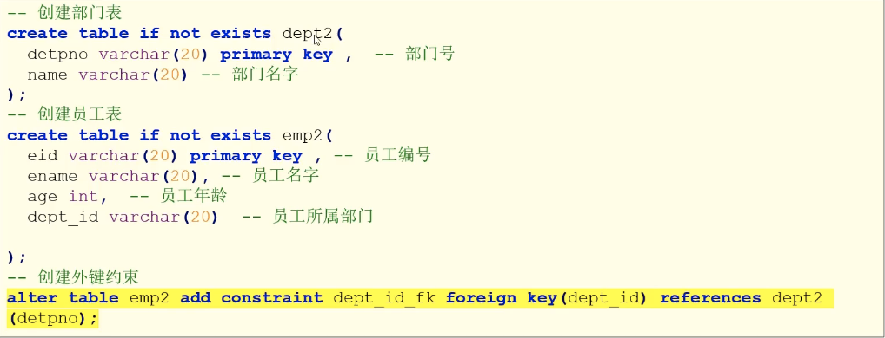
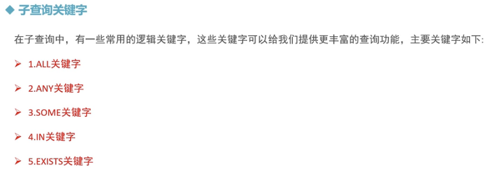

# MySQL的多表查询 -- 多表关系

- ###  介绍

  实际开发中，一个项目通常需要很多张表才能完成。例如：一个商城项目就需要分类表（category）、商品表(products)、订单表(orders)等多张表。且这些表的数据之间存在一定的关系，

# MySQL的多表操作 -- 多表关系

### 多表关系：

> mysql多表之间的关系可以概括:
>
> - 一对一
> - 一对多/多对一
> - 多对多

### **1.一对一关系**


### **2.一对多/多对一**


### **3.多对多关系**


---


## 外键约束


  


##  外键约束- 操作- 创建外键约束


> ```sql
> CREATE DATABASE if not EXISTS mydb3;
> 
> use mydb3;  
> 
> -- 创建部门表 -- 主表 
> CREATE TABLE if NOT EXISTS dept(
> 	deptno VARCHAR(20) PRIMARY KEY,  -- 部门编号 主键列 
> 	name VARCHAR(20)   --  部门名字
> );
> 
> -- 创建员工表，从表，并创建dept_id外键约束 - - 方式1 
> -- [constraint <外键名>] foreign key 字段名1 [, 字段名2, ...] references <主表名> 主键列1 [, 主键列2, ...]
> CREATE TABLE IF NOT EXISTS emp(
>   eid VARCHAR(20) PRIMARY KEY,  -- 员工编号 
> 	ename VARCHAR(20), -- 员工姓名 
> 	age int,
> 	dept_id VARCHAR(20), -- 员工所属部门 
> 	CONSTRAINT emp_fk foreign key(dept_id) references dept(deptno)
> 
> );
> ```




> ```sql
> -- 创建部门表 -- 主表 --方式2
> CREATE TABLE if NOT EXISTS dept2(
> 	deptno VARCHAR(20) PRIMARY KEY,  -- 部门编号 主键列 
> 	name VARCHAR(20)   --  部门名字
> );
> 
> -- 创建员工表，从表，并创建dept_id外键约束 - - 方式2 
> CREATE TABLE IF NOT EXISTS emp2(
>   eid VARCHAR(20) PRIMARY KEY,  -- 员工编号 
> 	ename VARCHAR(20), -- 员工姓名 
> 	age int,
> 	dept_id VARCHAR(20) -- 员工所属部门 
> );
> -- alter table <数据表名> add constraint <外键名> foreign key (<列名>) REFERENCES <主表名> （<列名>）
> ALTER TABLE emp2 ADD CONSTRAINT emp2_fk FOREIGN KEY (dept_id) REFERENCES dept2(deptno);
> 
> ```

## 外键约束- 操作- 在外键约束下的数据操作

### 1.数据插入

> 

```sql
-- 1.添加主表数据 
-- 注意必须先给主表添加数据 
INSERT into dept VALUES ('1001', '研发部');
INSERT into dept VALUES ('1002', '销售部');
INSERT into dept VALUES ('1003', '财务部');
INSERT into dept VALUES ('1004', '人事部');

-- 2.添加从表数据
-- 注意给从表添加数据， 外键列的值必须依赖主表的主键列 
INSERT into emp VALUES('1', '乔峰', 20, '1001');
INSERT into emp VALUES('2', '段誉', 21, '1001');
INSERT into emp VALUES('3', '虚竹', 23, '1001');
INSERT into emp VALUES('4', '阿紫', 18, '1002');
INSERT into emp VALUES('5', '扫地僧', 35, '1002');
INSERT into emp VALUES('6', '李秋水', 23, '1003');
INSERT into emp VALUES('7', '休闲鞋', 50, '1003');
INSERT into emp VALUES('8', '天山童姥', 60, '1005'); -- 无法插入，报错，收到主表外键约束
```

### 2.删除数据

> 

> ```sql
> -- 3. 删除数据
> DELETE FROM dept where deptno = '1001';   -- 不可删除
> DELETE FROM dept where deptno = '1004';   -- 主表1004没有被从表中的数据所依赖
> DELETE FROM emp where eid = '7';   -- 从表的数据可以被删除
> DELETE FROM emp;  -- 从表员工数据全被删除了
> 
> ```

## 外键约束- 操作- 删除外键约束


> ```sql
> -- 4，删除外键约束 
> -- alter table <表名> drop foreign key <外键约束名>;
> ALTER TABLE emp2 drop foreign key emp2_fk;
> ```
>
> 

 

## 外键约束 --- 多对多关系


> 
>
> 

> ```sql
> CREATE TABLE if not EXISTS student(
>  sid int PRIMARY KEY auto_increment,
>  name VARCHAR(20),
>  age int,
>  gender VARCHAR(20)
> 
> );
> CREATE TABLE if not EXISTS course(
>  cid int PRIMARY key auto_increment,
>  ciname VARCHAR(20)
> );
> 
> CREATE TABLE if not EXISTS score(
> sid int,
> cid int,
> score double
> );
> 
> ALTER TABLE score add foreign key(sid) REFERENCES student(sid);
> ALTER TABLE score add foreign key(cid) REFERENCES course(cid);
> 
> INSERT into 
> 	student 
> values
> 	(1, '小龙女', 18, '女'),
> 	(2, '阿紫', 20, '女'),
> 	(3, '周芷若', 19, '男');
> 
> 
> INSERT into course VALUES(1, '语文'), (2, '数学'),(3, '英语');
> INSERT into score VALUES(1,1,78),(1,2,75),(2,1,88),(2,2,90),(3,2,12),(3,3,45);
> 
> INSERT into sccore values(4,4,121) -- 不能添加，从表依赖两个主表
> 
> -- 修改和删除时，中间从表可以随便删除和修改，但是两边的主表，受从表依赖的关系，不能随便修改或者删除
> 
> ```
>
> 


---

# MySQL -多表操作-多表联合查询

 


###  多表查询 -- 准备查询数据


> ```sql
> -- 创建部门表
> CREATE TABLE if not EXISTS dept3(
>   deptno VARCHAR(20) PRIMARY key,  -- 部门号
> 	name VARCHAR(20)    -- 部门名字
> );
> 
> CREATE TABLE if NOT EXISTS emp3(
> 	eid VARCHAR(20) PRIMARY KEY, 
> 	ename VARCHAR(20),
> 	age int,
> 	dept_in VARCHAR(20)
> );
> 
> -- 添加数据 
> INSERT into dept3 VALUES ('1001', '研发部');
> INSERT into dept3 VALUES ('1002', '销售部');
> INSERT into dept3 VALUES ('1003', '财务部');
> INSERT into dept3 VALUES ('1004', '人事部');
> 
> INSERT into emp3 VALUES('1', '乔峰', 20, '1001');
> INSERT into emp3 VALUES('2', '段誉', 21, '1001');
> INSERT into emp3 VALUES('3', '虚竹', 23, '1001');
> INSERT into emp3 VALUES('4', '阿紫', 18, '1001');
> INSERT into emp3 VALUES('5', '扫地僧', 35, '1002');
> INSERT into emp3 VALUES('6', '李秋水', 23, '1002');
> INSERT into emp3 VALUES('7', '休闲鞋', 50, '1003');
> INSERT into emp3 VALUES('8', '天山童姥', 60, '1003'); 
> INSERT into emp3 VALUES('9', '慕容复', 40, '1003'); 
> INSERT into emp3 VALUES('10', '丁春秋', 60, '1005'); 
> ```

##  多表联合查询 - 交叉连接查询 - 

> 笛卡尔积 得到的表，相当于两张表相乘，


```sql
```


##  多表联合查询 - 内连接查询


> 
>
> 

```sql
-- 内连接查询 inner join 相当于求两张表的交集
-- 查询每个部门的所属员工
# 隐式内连接
SELECT * from dept3, emp3 where deptno = dept_in;
SELECT * from dept3, emp3 where dept3.deptno = emp3.dept_in;
# 显式内连接
SELECT * from dept3 inner JOIN emp3 on dept3.deptno = emp3.dept_in;
SELECT * from dept3 JOIN emp3 on dept3.deptno = emp3.dept_in;

-- 查询研发部的所属员工
# 显式内连接 
SELECT * from dept3 a inner join emp3 b on a.deptno = b.dept_in and a.name = '研发部';  
# 隐式内连接
SELECT * from dept3, emp3 where deptno = dept_in and name = '研发部' ;


-- 查询研发部和销售部的所属员工 
SELECT 
	* 
from 
	dept3 a inner join emp3 b 
on 
	a.deptno = b.dept_in and (a.name='研发部' or a.name='销售部'); 
	 
SELECT * from dept3 a inner join emp3 b on a.deptno = b.dept_in and a.name in('研发部', '销售部');

-- 查询每个部门的员工数，并升序排列 
SELECT 
	 dept3.name, dept3.deptno,  count(*) as num
from dept3 
	inner join emp3 
on 
	dept3.deptno = emp3.dept_in 
group by 
	dept3.deptno
order by 
	num asc
;

-- 查询人数大于等于3的部门，并按照人数降序排序 
SELECT 
	 dept3.deptno, dept3.name,  count(*) as num
from dept3 
	inner join emp3 
on 
	dept3.deptno = emp3.dept_in 
group by 
	dept3.deptno, dept3.name
having 
	num >= 3
order by 
	num desc
;

```


## 多表联合查询 - 外连接查询


> 

```sql
-- 外连接查询 
-- 查询哪些部门有员工，哪些部门没有员工 
SELECT * from dept3 LEFT outer JOIN emp3 on dept3.deptno = emp3.dept_in;

/*
 SELECT * 
 from A 
-- 	left join B on 条件1
-- 	left join C on 条件2 
-- 	left join D on 条件3 
*/

-- 查询哪些有员工有对应的部门，哪些没有 
SELECT * from dept3 RIGHT outer JOIN emp3 on dept3.deptno = emp3.dept_in;
SELECT * from dept3 RIGHT JOIN emp3 on dept3.deptno = emp3.dept_in;

-- 实现满外连接 full join
-- 使用union 关键字实现左外连接和右外连接的并集 

SELECT * from dept3 full JOIN emp3 on dept3.deptno = emp3.dept_in; -- 不能执行 

-- union 两张表相加然后 过滤掉重复的 行
SELECT * from dept3 LEFT outer JOIN emp3 on dept3.deptno = emp3.dept_in
union 
SELECT * from dept3 RIGHT JOIN emp3 on dept3.deptno = emp3.dept_in;


-- union all 两张表相加没有去重复（过滤）
SELECT * from dept3 LEFT outer JOIN emp3 on dept3.deptno = emp3.dept_in
union all
SELECT * from dept3 RIGHT JOIN emp3 on dept3.deptno = emp3.dept_in;

```


## 多表联合查询 - 子查询


> 
>
> ```sql
> -- 子查询 
>  
> -- 查询年龄最大的员工信息，显示信息包括员工号，员工名字，员工年龄 
> # 1. 查询最大年龄：
> SELECT max(age) from emp3;
> # 2.让每一个员工的年龄和最大的年龄进行比较，相等则满足条件
> --  单行单列， 可以作为一个值来使用
> SELECT * from emp3 where age = (SELECT max(age) from emp3); 
> 
> -- 查询年研发部和销售部的员工信息，包含员工号，员工姓名
> # 方式1:关联查询
> SELECT *
> from emp3 
> 	inner join dept3 on emp3.dept_in = dept3.deptno
> 	and name in('研发部','销售部');
> 
> # 方式2: 子查询 
> #-- 2.1 查询研发部和销售部的部门号： deptno,1001,1002
> SELECT deptno from dept3 where name in('研发部','销售部');  # 单列多行，多个值
> #-- 2.2 查询哪个员工的部门号是1001或者 1002
> SELECT * from emp3 where dept_in in(SELECT deptno from dept3 where name in('研发部','销售部'));
> 
> 
> -- 查询研发部20岁以下的员工信息，包括员工号、员工名字、部门名字 
> # 方式1: 关联查询 
> SELECT *
> from emp3 
> 	inner join dept3 on emp3.dept_in = dept3.deptno
> WHERE name='研发部' and age<20;
> SELECT * from emp3 
> 	inner join dept3 on emp3.dept_in = dept3.deptno and (name='研发部' and age<20);
> 	
> # 方式2: 子查询
> # 2.1 在部门表中查询研发部信息
> SELECT * from dept where name = '研发部'; -- 一行多列
> # 2.2 在员工表查询年龄小于20的员工信息
> SELECT * from emp3 where age < 30;   -- 多行多列
> # 2.3 将以上两个查询的结果进行关联查询
> SELECT * 
> from 
> 	(SELECT * from dept where name = '研发部') as t1
> 	join 
> 	(SELECT * from emp3 where age < 30) as t2
> 	on t1.deptno = t2.dept_in;  -- 多行多列, 这里必须有新的表名
> ```
>
> 

## 多表联合查询 - 子查询关键字




> ```sql
> -- 子查询-关键字 
> -- 关键字- all
> -- 1.查询年龄大于‘1003’部门所有年龄的员工信息 
> # 1.1 查询1003部门所有员工的年龄 
> SELECT age from emp3 where dept_in = '1003';
> SELECT * from emp3 where age > all(SELECT age from emp3 where dept_in = '1003');
> 
> 
> -- 2. 查询不属于任何一个部门的员工的信息
> SELECT * from emp3 where dept_in != all(SELECT deptno from dept3);
> 
> ```


> ```sql
> -- 子查询关键字-any/some 
> -- 查询的年龄大于‘1003’部门任意一个员工年龄的员工信息
> 
> SELECT * FROM emp3 
> where 
> 	age > any(SELECT age from emp3 where dept_in = '1003') 
> 	and dept_in != '1003';
> 	
> SELECT * FROM emp3 
> where 
> 	age > some(SELECT age from emp3 where dept_in = '1003') 
> 	and dept_in != '1003';
> 	
> ```


> ```sql
> -- 子查询关键字in
> -- 查询研发部和销售部的员工信息，包括员工号，员工姓名 
> SELECT 
> 	eid,ename,dept_in 
> from 
> 	emp3 
> where 
> 	dept_in in(SELECT deptno from dept3 where name in('研发部','销售部'));
> 	
> ```


```sql
-- 子查询关键字- exists 
-- 查询公司是否有大于60岁的员工，有则输出 
SELECT * from emp3 where EXISTS(SELECT 1);  -- 全表输出
SELECT * from emp3 where EXISTS(SELECT * from emp3); -- 全表输出
# 这里必须使用表的别名
SELECT * from emp3 e WHERE EXISTS(SELECT * from emp3 where e.age > 60);
#  使用关键字 in 也可以实现
SELECT * from emp3 e where eid in(SELECT eid from emp3 where e.age>60);


-- 查询有所属部门的员工信息
# 先查询前面的第一行，然后exists里面进行比较匹配，如果为true,输出前面的第一行数据，否则false；
# 只有员工表的dept_in在后面（EXISTS中）部门表中和 deptno向匹配，则返回行数据
SELECT *  from emp3 as a where EXISTS(SELECT * from dept3 as b where a.dept_in = b.deptno);
SELECT * from emp3 as a where EXISTS(SELECT * from emp3 where a.dept_in in(SELECT deptno from dept3));
#  使用关键字 in 也可以实现
SELECT * from emp3 as a where dept_in in(SELECT deptno from dept3 as b where a.dept_in = b.deptno )
```


## 多表联合查询 - 自关联查询/自连接


> ```sql
> -- 进行关联查询 
> -- 1.查询每个三国人物以及他的上级信息，
> # 一张表当成两张表使用 
> SELECT * from t_sanguo a, t_sanguo b where a.manager_id = b.eid;
> SELECT a.eid, a.ename, b.ename, b.eid from t_sanguo a join t_sanguo b on a.manager_id = b.eid;
> 
> -- 2. 查询所有人物以及上级 
> SELECT * from t_sanguo a left outer join t_sanguo b on a.manager_id = b.eid;
> 
> -- 3.查询所有人物、上级、上上级， 
> SELECT 
> 	* 
> from 
> 	t_sanguo a 
> 	left outer join t_sanguo b on a.manager_id = b.eid
> 	left outer join t_sanguo c on b.manager_id = c.eid;
> 
> 
> ```
>
> 


## 练习

### 数据准备

> ```sql
> -- 创建test1数据库 
> CREATE DATABASE IF NOT EXISTS test1;
> 
> -- 选择使用数据库test 
> use test1;
> 
> -- 创建部门表 
> CREATE TABLE if not EXISTS dept(
> 	deptno int PRIMARY KEY,  -- 部门编号 
> 	dname VARCHAR(14),  -- 部门名称 
> 	loc VARCHAR(13)   -- 部门地址 
> );
> 
> INSERT into dept VALUEs (10, 'accounting','new york');
> INSERT into dept VALUEs (20, 'research','dallas');
> INSERT into dept VALUEs (30, 'sales','chicage');
> INSERT into dept VALUEs (40, 'operations','boston');
> 
> -- 创建员工表 
> CREATE TABLE if not EXISTS emp(
> 	empno int PRIMARY KEY,
> 	ename VARCHAR(10),
> 	job VARCHAR(9),
> 	mgr int,
> 	hiredata date,
> 	sal DOUBLE,
> 	comm DOUBLE,
> 	deptno int
> );
> -- 添加 部门 和 员工 之间的外键约束关系 
> ALTER TABLE emp add constraint emp_fk FOREIGN KEY emp(deptno) REFERENCES dept(deptno);
> 
> --  插入数据
> INSERT INTO emp VALUES(7369, 'simth', 'clerk',7902,'1980-12-17',800,null, 20);
> INSERT INTO emp VALUES(7499, 'allen', 'salesman',7698,'1981-02-17',1600,300, 30);
> INSERT INTO emp VALUES(7521, 'ward', 'salesman',7698,'1981-12-22',1250,500, 30);
> INSERT INTO emp VALUES(7566, 'jones', 'manager',7839,'1981-12-17',2975,null, 20);
> INSERT INTO emp VALUES(7654, 'martin', 'salesman',7698,'1981-12-17',1250,1400, 30);
> INSERT INTO emp VALUES(7698, 'blake', 'manager',7839,'1981-12-17',2850,null, 30);
> INSERT INTO emp VALUES(7782, 'clark', 'manager',7839,'1987-12-17',2450,null, 10);
> INSERT INTO emp VALUES(7788, 'scott', 'analyst',7566,'1980-12-17',3000,null, 20);
> INSERT INTO emp VALUES(7839, 'king', 'president',null,'1983-12-17',5000,null, 10);
> INSERT INTO emp VALUES(7844, 'turner', 'salesman',7698,'1985-12-17',1500,0, 30);
> INSERT INTO emp VALUES(7876, 'adams', 'clerk',7788,'1986-12-17',1100,null, 20);
> INSERT INTO emp VALUES(7900, 'james', 'clerk',7698,'1988-12-17',950,null, 30);
> INSERT INTO emp VALUES(7902, 'ford', 'analyst',7566,'1981-12-17',3000,null, 20);
> INSERT INTO emp VALUES(7934, 'miller', 'clerk',7782,'1983-12-17',1300,null, 10);
> 
> -- 创建工资等级表 
> CREATE TABLE if not EXISTS salgrade(
> grade int,    -- 等级 
> losal double, -- 最低工资 
> hisal double -- 最高工资 
> );
> INSERT into salgrade VALUES(1,700,1200);
> INSERT into salgrade VALUES(2,1201,1400);
> INSERT into salgrade VALUES(3,1401,2000);
> INSERT into salgrade VALUES(4,2001,3000);
> INSERT into salgrade VALUES(5,3001,9999);
> 
> ```
>
> 

### 练习

```sql
-- 创建test1数据库 
CREATE DATABASE IF NOT EXISTS test1;

-- 选择使用数据库test 
use test1;

-- 创建部门表 
CREATE TABLE if not EXISTS dept(
	deptno int PRIMARY KEY,  -- 部门编号 
	dname VARCHAR(14),  -- 部门名称 
	loc VARCHAR(13)   -- 部门地址 
);

INSERT into dept VALUEs (10, 'accounting','new york');
INSERT into dept VALUEs (20, 'research','dallas');
INSERT into dept VALUEs (30, 'sales','chicage');
INSERT into dept VALUEs (40, 'operations','boston');

-- 创建员工表 
CREATE TABLE if not EXISTS emp(
	empno int PRIMARY KEY,
	ename VARCHAR(10),
	job VARCHAR(9),
	mgr int,
	hiredata date,
	sal DOUBLE,
	comm DOUBLE,
	deptno int
);
-- 添加 部门 和 员工 之间的外键约束关系 
ALTER TABLE emp add constraint emp_fk FOREIGN KEY emp(deptno) REFERENCES dept(deptno);

--  插入数据
INSERT INTO emp VALUES(7369, 'simth', 'clerk',7902,'1980-12-17',800,null, 20);
INSERT INTO emp VALUES(7499, 'allen', 'salesman',7698,'1981-02-17',1600,300, 30);
INSERT INTO emp VALUES(7521, 'ward', 'salesman',7698,'1981-12-22',1250,500, 30);
INSERT INTO emp VALUES(7566, 'jones', 'manager',7839,'1981-12-17',2975,null, 20);
INSERT INTO emp VALUES(7654, 'martin', 'salesman',7698,'1981-12-17',1250,1400, 30);
INSERT INTO emp VALUES(7698, 'blake', 'manager',7839,'1981-12-17',2850,null, 30);
INSERT INTO emp VALUES(7782, 'clark', 'manager',7839,'1987-12-17',2450,null, 10);
INSERT INTO emp VALUES(7788, 'scott', 'analyst',7566,'1980-12-17',3000,null, 20);
INSERT INTO emp VALUES(7839, 'king', 'president',null,'1983-12-17',5000,null, 10);
INSERT INTO emp VALUES(7844, 'turner', 'salesman',7698,'1985-12-17',1500,0, 30);
INSERT INTO emp VALUES(7876, 'adams', 'clerk',7788,'1986-12-17',1100,null, 20);
INSERT INTO emp VALUES(7900, 'james', 'clerk',7698,'1988-12-17',950,null, 30);
INSERT INTO emp VALUES(7902, 'ford', 'analyst',7566,'1981-12-17',3000,null, 20);
INSERT INTO emp VALUES(7934, 'miller', 'clerk',7782,'1983-12-17',1300,null, 10);

-- 创建工资等级表 
CREATE TABLE if not EXISTS salgrade(
grade int,    -- 等级 
losal double, -- 最低工资 
hisal double -- 最高工资 
);
INSERT into salgrade VALUES(1,700,1200);
INSERT into salgrade VALUES(2,1201,1400);
INSERT into salgrade VALUES(3,1401,2000);
INSERT into salgrade VALUES(4,2001,3000);
INSERT into salgrade VALUES(5,3001,9999);


-- 练习 
-- 1，返回拥有员工的部门名、部门号 
SELECT * from dept d WHERE EXISTS(SELECT * from emp e where d.deptno=e.deptno);
# 这里 distinct 接两个字段，表示，distinct 后面两个字段完全一样才会被去重
SELECT DISTINCT d.dname,d.deptno from dept d inner JOIN emp e on d.deptno=e.deptno;

-- 2. 工资水平多余simth的员工信息
# 先查smith的工资水平 
SELECT * from emp where sal > (SELECT sal from emp where ename='simth');

-- 3.返回员工和所属经理的姓名 -- 自关联
SELECT * from emp a INNER JOIN emp b on a.mgr = b.empno;
SELECT 
	a.ename,a.empno, a.mgr,b.empno, b.ename 
from 
	emp a INNER JOIN emp b on a.mgr = b.empno;

-- 4. 返回雇员的雇佣日期早于其经理雇佣日期的员工以及其经理姓名 
SELECT 
	a.ename, a.hiredata, b.ename, b.hiredata 
from 
	emp a INNER JOIN emp b on a.mgr = b.empno and a.hiredata < b.hiredata;

-- 5.返回员工姓名以及所在的部门名称
SELECT a.ename, b.dname from emp a join dept b on a.deptno = b.deptno; 

-- 6. 返回从事 clerk工作的员工姓名和所在部门名称 
SELECT a.ename,a.job, b.dname from emp a join dept b on a.deptno = b.deptno and a.job = 'clerk'; 

-- 7. 返回部门号及其本部门的最低工资 
SELECT a.deptno, min(sal) from emp a GROUP BY deptno;

-- 8. 返回销售部（sales）所有员工的姓名 
SELECT a.ename, b.dname FROM emp a,dept b where a.deptno = b.deptno and b.dname = 'sales';
 
 
-- 9. 返回工资水平多于平均工资的员工 
SELECT * from emp where sal > (SELECT avg(sal) from emp as avg_sal);

-- 10. 返回与scott从事相同工作的员工 
SELECT * 
from emp 
where 
	job = (SELECT 
						a.job 
				from 
					emp a 
				where 
					a.ename = 'scott'
					) 
	and ename != 'scott';
	
	
-- 11.返回工资高于30部门所有员工工资水平的员工信息 
SELECT * 
FROM emp e1 
where 
	sal > all(SELECT sal from emp b where b.deptno = 30)
 and e1.deptno != 30;

-- 12.返回员工工作及其从事此工作的最低工资 -- 以job 来分组，并且统计 min(sal)
SELECT job, min(sal) FROM emp GROUP BY job; 


-- 13.计算员工的年薪，并且以年薪排序
SELECT 
	a.ename, (a.sal * 12 + IFNULL(a.comm,0)) as year_sal 
from 
	emp a 
order by 
	year_sal desc;

-- 14. 返回工资处于第四级别的员工的姓名
SELECT 
	a.ename, a.sal 
from 
	emp a 
where 
	a.sal BETWEEN 
						(SELECT losal from salgrade where grade = 4) 
				AND 
						(SELECT hisal from salgrade where grade = 4);


-- 15. 返回工资为二等级的职员姓名、部门所在地

SELECT 
	a.ename,a.sal, b.loc, c.grade 
from 
	emp a join dept b on a.deptno = b.deptno
	join salgrade c on grade=2
	and (a.sal BETWEEN 
								(SELECT losal from salgrade where grade = 2)
						 AND
								(SELECT hisal from salgrade where grade = 2)
			);

-- ----
SELECT 
	* 
from 
	dept a 
JOIN emp b on a.deptno = b.deptno
join salgrade c on grade = 2 and b.sal >= c.losal and b.sal <=c.hisal;

-- -----
SELECT 
	* 
from 
	dept a, emp b,salgrade c 
where 
a.deptno = b.deptno 
and 
grade = 2 
and 
b.sal >= c.losal 
and b.sal <=c.hisal;
```


