# MySQL 函数


## MySQL 聚合函数

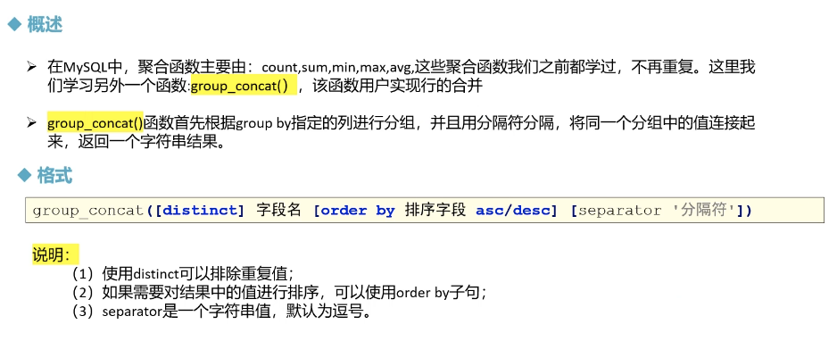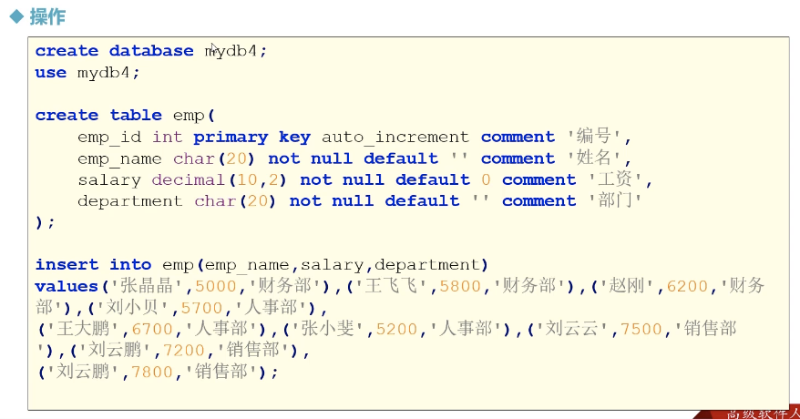

> ```sql
> --  将所有员工的名字合并成一行 
> SELECT GROUP_CONCAT(emp_name) from emp;
> 
> -- 指定分隔符合并
> SELECT GROUP_CONCAT(emp_name SEPARATOR '-->') from emp;
> 
> -- 指定排序方式和分隔符 
> SELECT department, GROUP_CONCAT(emp_name SEPARATOR ' --> ') from emp group by department;
> # distinct 可以排出重复值
> SELECT 
> 	department, GROUP_CONCAT
> 	(DISTINCT emp_name order by salary desc SEPARATOR ' --> ') 
> from emp group by department;
> 
> ```

## MySQL 数学函数

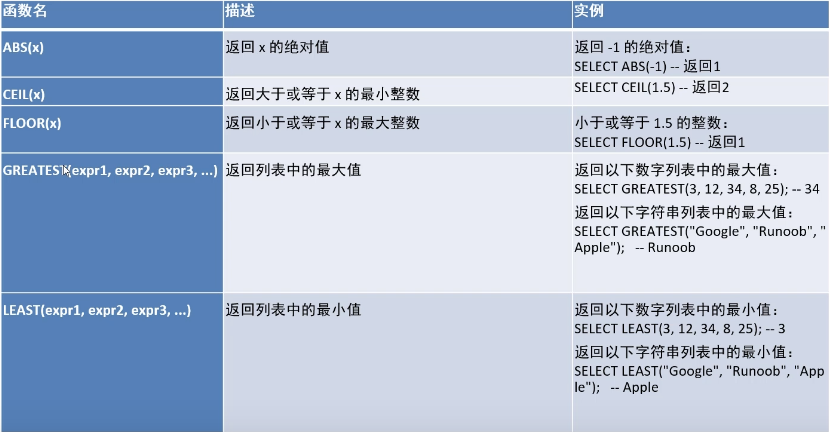

> ```SQL
> -- 数学函数 
> SELECT ABS(-10);  # 输出10
> SELECT ABS(10);
> SELECT ABS(表达式或者字段) from 表;
> 
> -- 向上取整，返回比x大的最小整数
> SELECT CEIL(1.1); # 向上取整，输出2 
> SELECT CEIL(1.0); # 输出1
> 
> -- 想下取整，返回比x小的最大整数 
> SELECT FLOOR(1.1);  # 输出1
> SELECT FLOOR(1.9);  # 输出1
> 
> 
> -- 去列表最大值 
> SELECT GREATEST(1,2,3); -- 3
> SELECT LEAST(1,2,3); -- 1
> 
> ```

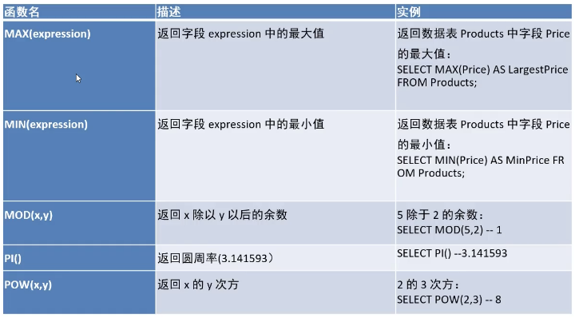

> ```sql
> -- 取模 
> SELECT MOD(5,2); -- 1
> 
> -- 圆周率
> SELECT PI();
> 
> -- 乘方/次方 x的y次方 
> SELECT POW(2,3);
> 
> ```

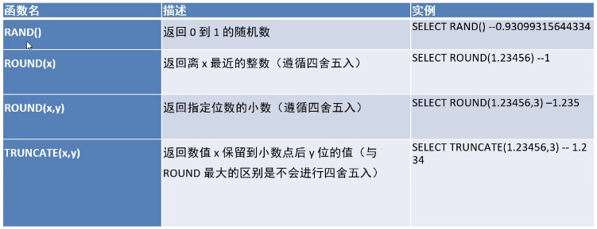

> ```sql
> -- 取随机数, rand()默认返回0-1之间的随机数 
> SELECT RAND();
> SELECT floor(RAND()*100);  # 0-100 随机数 
> 
> -- 小数,四舍五入取整 ，ROUND(X,D), D表示保留小数位数 
> SELECT ROUND(3.5414); -- 4
> SELECT ROUND(3.4); -- 3
> SELECT ROUND(3.5412312, 3);  # 取三位小数 输出 3.541
> 
> SELECT deptno, ROUND(avg(sal),3) from test1.emp GROUP BY deptno; 
> 
> 
> -- truncate 处理小数：从保留小数位置数-切除 
> SELECT TRUNCATE(3.1415,3);  -- 3.141
> ```
>
> 

## MySQL 字符串函数

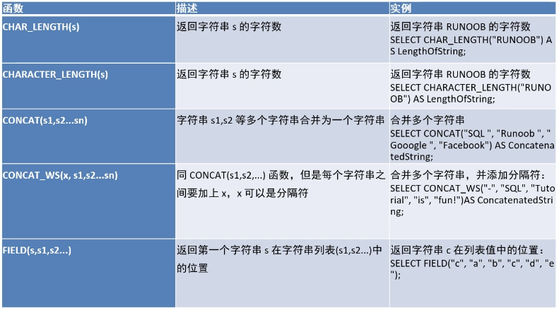

> ```sql
> -- 字符串函数
> 	-- 1. 获取字符串的个数/长度 CHAR_LENGTH() = character_length()
> SELECT CHAR_LENGTH('hello world'); -- 11
> SELECT char_length("你好吗"); -- 长度为3
> SELECT CHARACTER_LENGTH('hello world'); -- 11
> SELECT CHARACTER_LENGTH("你好吗"); -- 长度为3
>  
> -- length()函数，返回的单位字节， 一个英文字母占1个byte， 
> SELECT LENGTH('hello'); -- 5
> SELECT LENGTH("你好吗");  -- 9，mysql 使用的utf8， 一个汉字占3个字节
> 
>  -- 2. concat()函数，字符串合并 
>  SELECT CONCAT('hello','world');
>  SELECT CONCAT(c1,c2) from table_name; # 将两列合并 
>  
>  -- 3.  指定分隔符的字符串合并，函数concat_ws();
>  SELECT CONCAT_WS('--','hello','world');
>  
>  -- 4.返回字符串在字符串列表中第一次出现的位置，从1开始
>  -- FIELD(str,str1,str2,str3,...), 
>  SELECT FIELD('aaa','aaa','bbb','ccc'); -- 1
>  SELECT FIELD('bbb','aaa','bbb','ccc'); -- 2
>  SELECT FIELD('aaa','aaa','aaa','ccc'); -- 1
> ```
>
> 

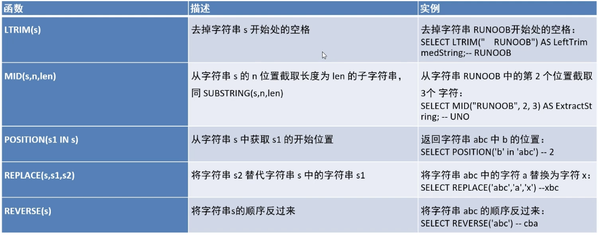

> ```sql
> -- 5. 去除字符串左边空格 
> SELECT LTRIM('  aaa');
> SELECT RTRIM(' -  aaa  '); # 去除右端空格
> SELECT TRIM('      -aaa-    ');  # 去除两端空格 
> 
> 
> -- 6. 截取字符串  MID(str,pos,len), index从1开始
> SELECT MID('helloworld',2,4);
> SELECT MID('helloworld',2,CHAR_LENGTH('helloworld')-1);
> 
> 
> -- 7. 判断一个字符串a 在字符串b中的位置 POSITION(substr IN str)
> SELECT POSITION('abc' IN 'helloabcworldabc');  --  从位置5开始匹配substr 
> 
> -- 8.字符串替换 (str,from_str,to_str)
> SELECT REPLACE('aaahelloaaaworld','aaa','bbb'); -- bbbhellobbbworld
> 
> -- 9.字符串的翻转
> SELECT REVERSE('abc');  -- cba 
> 
> 
> 
> ```
>
> 

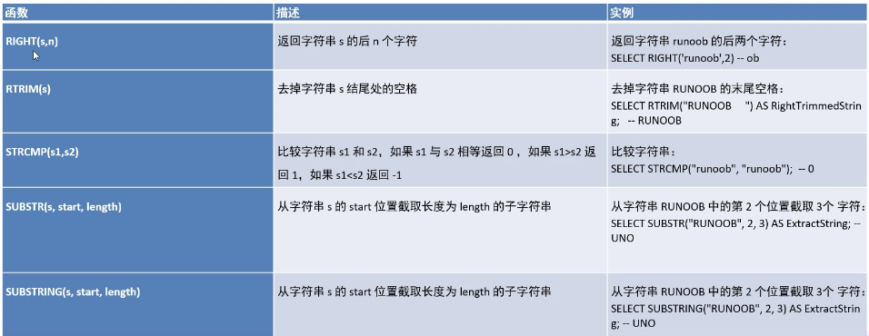

> ```sql
> -- 10.返回字符串的后几个字符 RIGHT(str,len)
> SELECT RIGHT('hello',3); -- llo
> 
> -- 11. 比较两个字符串, 比较字符串在字典中出现的先后顺序 
> SELECT STRCMP('hello','world'); -- 返回 -1， hello < world  ??? 
> 
> -- 12.字符串的截取 SUBSTR(str FROM pos FOR len) = SUBSTR(str,pos,len)
> SELECT SUBSTR('helloworld',2,4);  -- ello
> SELECT SUBSTR('helloworld' FROM 2 FOR 4);  -- ello
> SELECT SUBSTRING('helloworld',2,4);  -- ello
> ```
>
> 

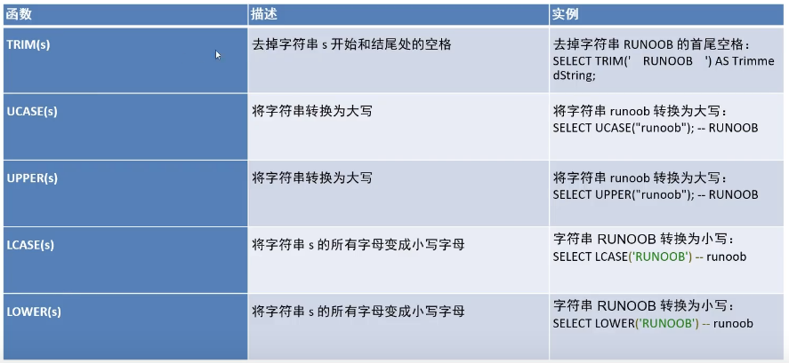

> ```sql
> -- 13. 字符串小写--> 大写 UPPER(str),UCASE(str)
> SELECT UPPER('hello');
> SELECT UCASE('hello');
> 
> -- 14. 字符串大写--> 小写 
> SELECT LCASE('Hello');
> SELECT LOWER('HELLO');
> ```
>
> 

`SELECT ename, SUBSTR(hiredata,1,4) FROM test1.emp;`

## MySQL 日期函数

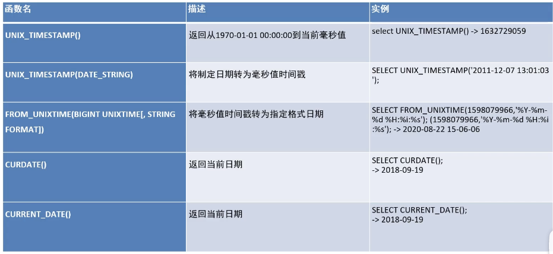

> ```sql
> -- 日期函数 
> 
> -- 1. 返回时间戳，1970-01-01 到当前时间(毫秒值) 
> SELECT UNIX_TIMESTAMP();
> 
> 
> -- 2.将一个指定日期转为时间戳 
> SELECT UNIX_TIMESTAMP('2021-12-21 08:08:08');  -- 1640045288
> 
> -- 3. 将毫秒值（时间戳）转为 指定格式的日期 
> SELECT FROM_UNIXTIME(1640045288,'%Y-%m-%d %H:%i:%s');
> 
> -- 4.获取当前的日期 
> SELECT CURDATE();  -- 2022-03-19
> SELECT CURRENT_DATE();  -- 2022-03-19
> 
> ```
>
> 日期的格式附表如下:
>
> 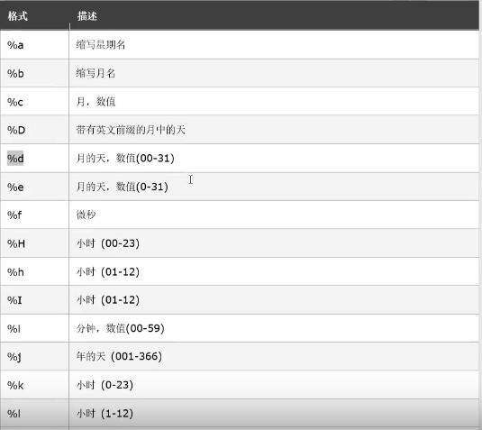
>
> 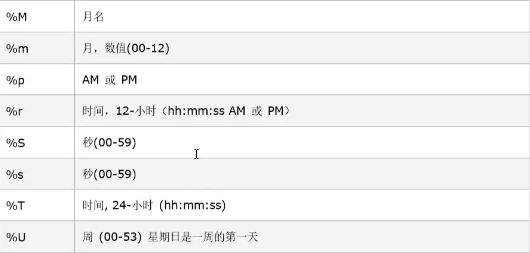
>
> 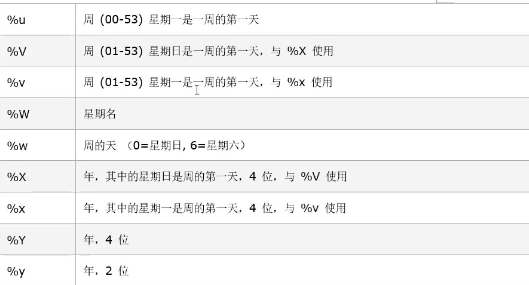

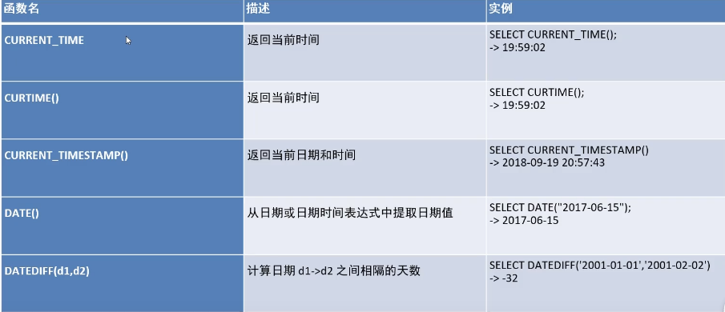

> ```sql
> -- 5.获取当前的时分秒 
> SELECT CURRENT_TIME();  -- h:i:s
> SELECT CURTIME();
> 
> -- 6. 获取年月日时分秒 
> SELECT CURRENT_TIMESTAMP();  -- 2022-03-19 14:45:06
> 
> -- 7. 从日期字符串中获取年月日 
> SELECT DATE('2022-2-12 12:34:56');  -- 2022-02-12
> 
> -- 8. 获取两个日期之间的间隔了多少天 
> SELECT DATEDIFF('2000-1-1','2021-12-31'); -- -8035
> SELECT DATEDIFF(CURRENT_DATE(),'2008-8-8'); -- 4971
> 
> ```
>
> 

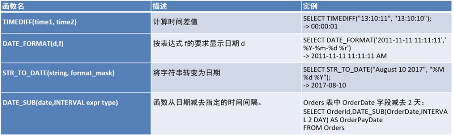

> ```sql
> -- 9. 计算两个时分秒 之间的差别  计算一天内时间的差值(秒级 )
> SELECT CURRENT_TIME();
> SELECT TIMEDIFF(CURRENT_TIME(),'10:18:56');  -- 04:32:53
> 
> -- 10. 将日期按照指定的格式进行显示--日期格式化。DATE_FORMAT(date,format)
> SELECT DATE_FORMAT('2021-1-1 1:1:1','%Y-%m-%d %H:%i:%s'); -- 2021-01-01 01:01:01
> 
> 
> -- 11. 将字符串转为日期，类似于日期格式化STR_TO_DATE(str,format) 
> SELECT STR_TO_DATE('2021-1-1 1:1:1','%Y-%m-%d %H:%i:%s');
> SELECT STR_TO_DATE('August 10 2017','%M %d %Y'); # 2017-08-10
> 
> -- 12.将日期进行减法 DATE_SUB(date,INTERVAL expr unit)
> SELECT DATE_SUB('2021-10-01',INTERVAL 2 day); -- 2021-09-29
> 
> ```
>
> 

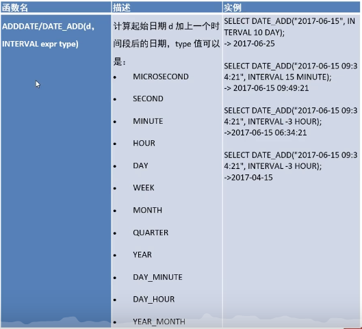

> ```sql
> -- 13.将日期进行加法-- 日期的跳转 
> SELECT DATE_ADD('2021-10-01',INTERVAL 2 day);  -- 2021-10-03
> SELECT ADDDATE('2021-10-01',INTERVAL 2 day); -- 2021-10-03
> SELECT DATE_ADD('2021-10-01',INTERVAL 2 MONTH);  -- 2021-12-01
> ```
>
> 

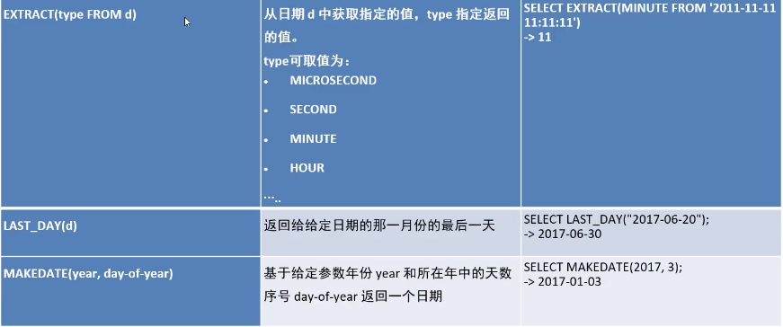

> ```sql
> -- 14. 从日期中获取想要的值   
> SELECT EXTRACT(hour FROM '2021-12-13 12:13:14');
> SELECT EXTRACT(MINUTE FROM '2021-12-13 12:13:14');
> SELECT EXTRACT(year FROM '2021-12-13 12:13:14');
> SELECT EXTRACT(month FROM '2021-12-13 12:13:14');
> 
> -- 15.获取给定日期的最后一天 
> SELECT LAST_DAY('2021-12-13 12:13:14')  -- 2021-12-31
> 
> -- 16，MAKEDATE(year,dayofyear)获取指定年份和天数的日期 
> SELECT MAKEDATE(2021,100); -- return 2021-04-10
> 
> 
> ```
>
> 

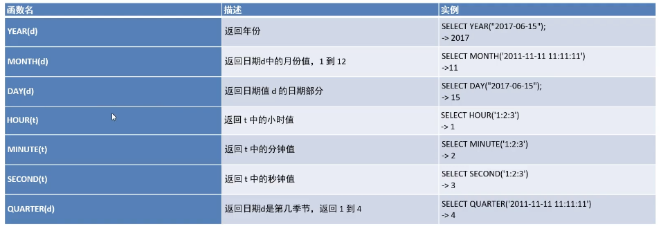

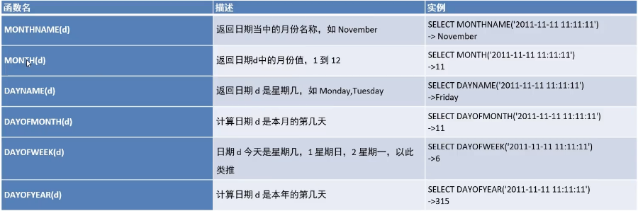

> ```sql
> -- 17.根据日期获取年月日时分秒 
> SELECT EXTRACT(hour FROM '2021-12-13 12:13:14');
> SELECT YEAR('2021-12-13 12:13:14');
> SELECT MONTH('2021-12-13 12:13:14');
> SELECT DAY('2021-12-13 12:13:14');
> SELECT MINUTE('2021-12-13 12:13:14');
> SELECT QUARTER('2021-12-13 12:13:14'); -- 4
> 
> SELECT MONTHNAME('2021-12-13 12:13:14'); -- december
> SELECT DAYNAME('2021-12-13 12:13:14'); -- monday
> SELECT DAYOFMONTH('2021-12-13 12:13:14'); -- 13 获取改月的第几天
> SELECT DAYOFWEEK('2021-12-13 12:13:14');  -- 2  获取本周的第几天
> SELECT DAYOFYEAR('2021-12-13 12:13:14');  -- 347 获取一年中的第几天 
> 
> 
> ```

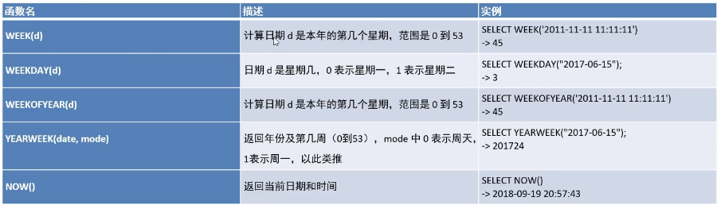

> ```sql
> -- 18. 
> SELECT WEEK('2021-12-13 12:13:14'); -- 50 计算当前日期是该年的第几周 
> SELECT WEEKDAY('2021-12-13 12:13:14'); -- 0 表示星期一， 获取日期date是星期几 
> SELECT WEEKOFYEAR('2021-12-13 12:13:14'); -- 50
> SELECT YEARWEEK('2021-12-13 12:13:14'); -- 202150:表示当前日期为2021年第50周 
> SELECT NOW();  -- 获取当前日期和时间 2022-03-19 15:24:57
> 
> ```
>
> 

## MySQL 控制流函数

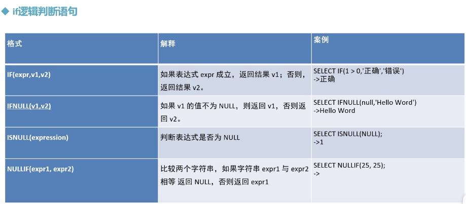

>```SQL
>-- 控制流函数 
>-- 1. IF(expr1,expr2,expr3)
>SELECT IF(5>3,'大于','小于');  -- 大于 
>SELECT *,if(s.score >= 85, '优秀','及格') flag from mydb3.score s;
>
>-- 2.IFNULL(expr1,expr2)
>SELECT IFNULL(NULL,'ASDASD');  -- ASDASD
>SELECT IFNULL(5,0); -- 5
>SELECT *, IFNULL(comm,0) as flag from test1.emp;
>
>-- 3.ISNULL(expr)
>SELECT ISNULL(NULL); -- 1=true 
>SELECT ISNULL(0);  -- 0=false 
>
>-- 4. NULLIF(expr1,expr2)，判断两个字符是否相同，相同返回null，否则返回expr1 
>SELECT NULLIF(35,35);  -- 返回null 
>SELECT NULLIF(35,20);  -- 返回35第一个值 
>```
>
>

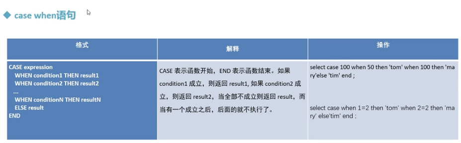


>```sql
>use mydb4;
>CREATE TABLE if not EXISTS orders(
>
>	oid int PRIMARY key,
>	price double,
>	patTyple int 
>);
>
>INSERT into orders VALUES(1,1220,1);
>INSERT into orders VALUES(2,1000,2);
>INSERT into orders VALUES(3,200,3);
>INSERT into orders VALUES(4,3000,1);
>INSERT into orders VALUES(5,1500,2);
>-- 方式1:
>SELECT
>	*,
>	CASE patTyple
>		WHEN 1 THEN
>			'wechat pay'
>		WHEN 2 THEN
>			'alipay'
>		WHEN 3 THEN
>			'credit card'
>		ELSE
>			'other'
>	END as payTypeStr
>from orders
>;
>-- 方式2:
>SELECT
>	*,
>	CASE 
>		WHEN patTyple =1 THEN
>			'wechat pay'
>		WHEN patTyple=2 THEN
>			'alipay'
>		WHEN patTyple=3 THEN
>			'credit card'
>		ELSE
>			'other'
>	END as payTypeStr
>from orders
>;
>```


## MySQL 窗口函数/开窗函数

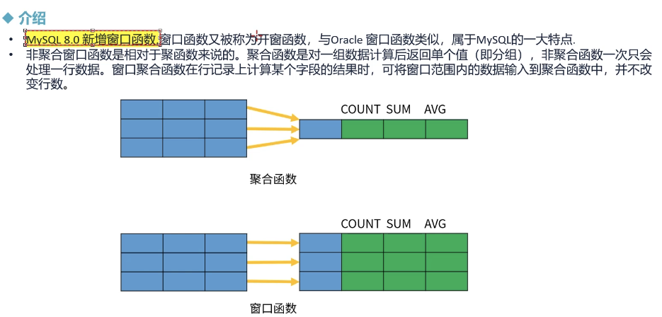

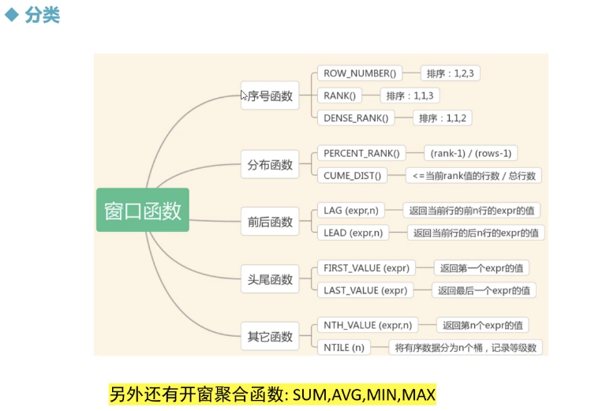

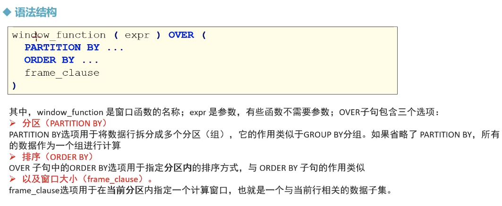

### 1.序号函数

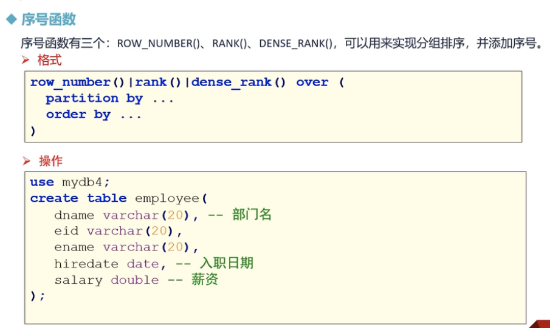

> 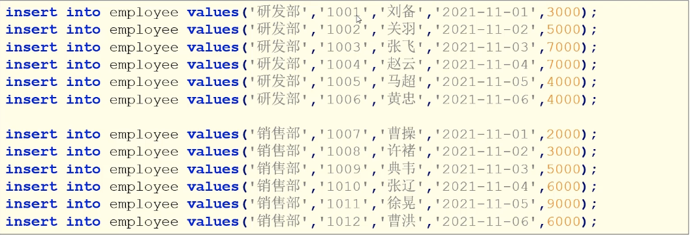
>
> 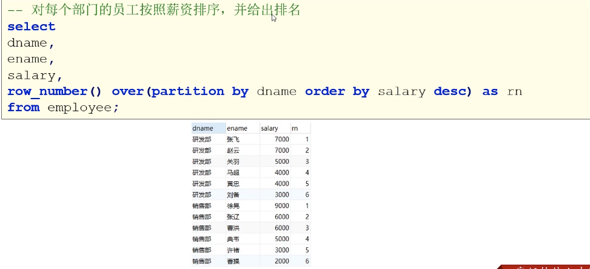
>
> 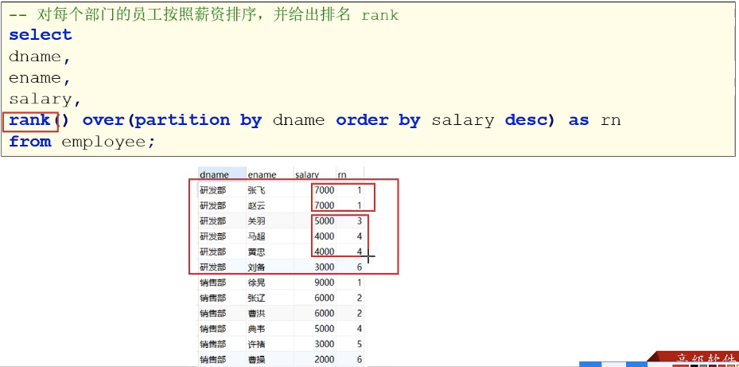
>
> 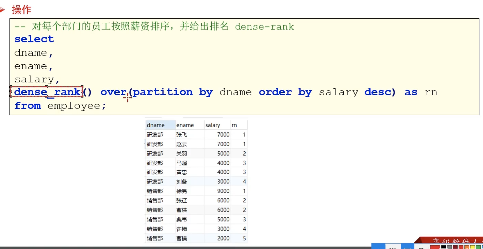

>```sql
>-- 对每个部门的员工按照薪资排序，并给出排名 
>-- ROW_NUMBER(), RANK(), DENSE_RANK()
>SELECT 
>	dname,ename,salart,
>	ROW_NUMBER() over(PARTITION by dname order by salart desc) as row_num,
>	RANK() over(PARTITION by dname order by salart desc) as rnk,
>	DENSE_RANK() over(PARTITION by dname order by salart desc) as d_rnk
>from employee;
>
>-- 求出每个部门薪资排在前三名的员工( 分组求top-n 问题 )
>SELECT * from
>(
>	SELECT 
>		dname,
>		ename,
>		salart,
>		DENSE_RANK() over(PARTITION by dname order by salart desc) as d_rnk
>	from employee
>) as t
>where t.d_rnk <=3;
>
>-- 对所有员工进行全局排序（不分组）
>-- 不加partition by 表示全局排序
>SELECT 
>	dname,
>	ename,
>	salart,
>	DENSE_RANK() over(order by salart desc) as d_rnk
>from employee;
>
>
>
>```
>
>
>
>

### 2.开窗聚合函数

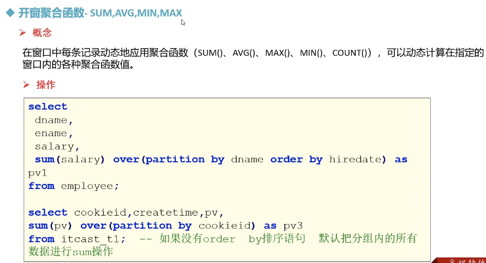

> ```sql
> -- 开窗聚合函数 
> -- sum()开窗可以实现累计的效果 
> SELECT
>  dname,ename,hiredate,salart,
>  sum(salart) over(PARTITION BY dname order by hiredate) as c1
> from employee;	
> ```
>
> 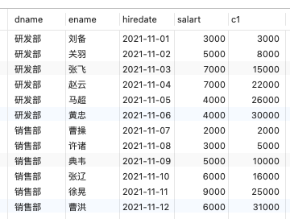
>
> ```sql
> -- 去掉order by, 把分组所有数据相加，可以体现个人薪资占全部薪资的比例 
> SELECT
>  dname,ename,hiredate,salart,
>  sum(salart) over(PARTITION BY dname) as c1
> from employee;	
> ```
>
> 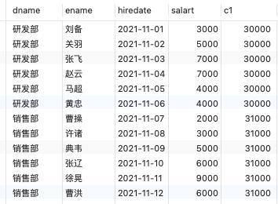
>
> ```sql
> # 当前行 + 之前所有的行的数据 
> SELECT
>  dname,ename,hiredate,salart,
>  sum(salart) over(
> 							PARTITION BY dname 
> 							order by hiredate 
> 							rows BETWEEN unbounded preceding and current row
> 							) as c1
> from employee;	
> -- ------
> # 当前 + 之前3行的数据, 表示一个范围 
> SELECT
>  dname,ename,hiredate,salart,
>  sum(salart) over(
> 							PARTITION BY dname 
> 							order by hiredate 
> 							rows BETWEEN 3 preceding and current row
> 							) as c1
> from employee;	
> -- 
> # 当前行数据 + 之前3行数据 + 之后1行数据 = 结果
> SELECT
>  dname,ename,hiredate,salart,
>  sum(salart) over(
> 							PARTITION BY dname 
> 							order by hiredate 
> 							rows BETWEEN 3 preceding and 1 following
> 							) as c1
> from employee;	
> -- ---
> # 当前行 的数据 + 之后所有行的数据 
> SELECT
>  dname,ename,hiredate,salart,
>  sum(salart) over(
> 							PARTITION BY dname 
> 							order by hiredate 
> 							rows BETWEEN current row and unbounded following
> 							) as c1
> from employee;	
> 
> ```
>
> ```sql
> # 求当前薪资的均值 
> SELECT
>  dname,ename,hiredate,salart,
>  avg(salart) over(PARTITION BY dname order by hiredate) as c1
> from employee;	
> # 求当前薪资的最大值 
> SELECT
>  dname,ename,hiredate,salart,
>  max(salart) over(PARTITION BY dname order by hiredate) as c1
> from employee;	
> ```
>
> 

### 3.分布函数

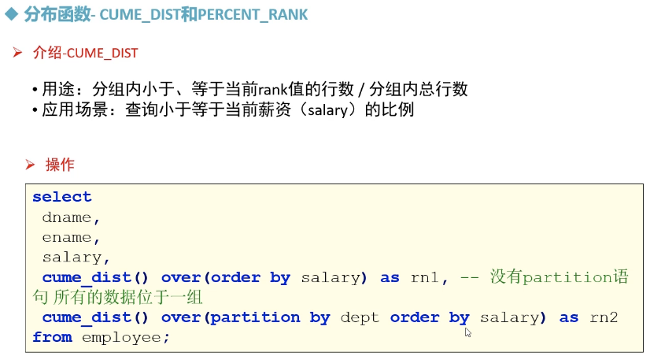

>```sql
>-- 窗口函数-分布函数 
>#  分组内 小于等于 当前 rank值的行数/分组内总行数
>SELECT 
>dname,ename,salart,
>CUME_DIST() over(ORDER BY salart) as rn1,
>CUME_DIST() over(PARTITION by dname ORDER BY salart) as rn2
>from employee;
>```
>
>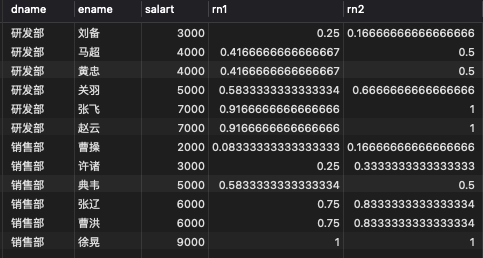
>
>

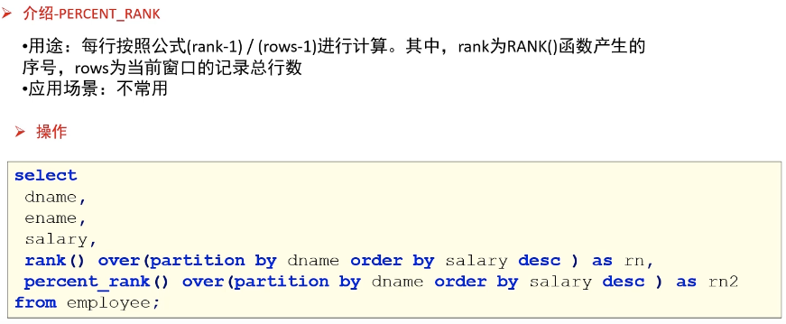


>```sql
>-- 
>SELECT 
>dname,ename,salart,
>rank() over(PARTITION by dname ORDER BY salart desc) as rn,
>PERCENT_RANK() over(PARTITION by dname ORDER BY salart desc) as rn2
>from employee;
>/*
>	rn2: 
>	第一行: (rank-1)/(rows-1)
>				 (1-1)/(6-1) = 0
>	第二行: (rank=1 -1 )/(6-1) = 0
>	第三行: (rank=3 -1 )/(6-1) = 2/5=0.4
>	
>应用场景：不常用 
>
>*/
>
>```
>
>
>
>

### 4.前后函数

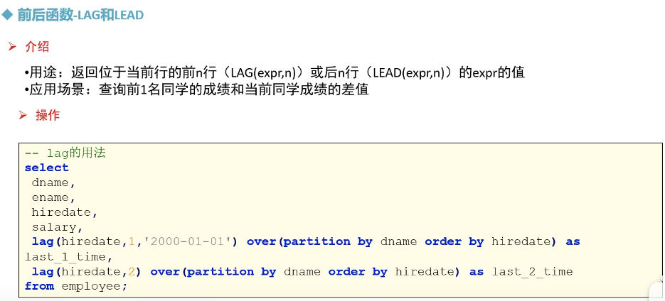

>```sql
>-- LAG(expr[,N[,default]])的用法 --- 滞后
>SELECT 
>dname,ename,salart,hiredate,
>lag(hiredate,1,'2000-01-01') over(PARTITION by dname ORDER BY hiredate desc) as time1,
>lag(hiredate,2) over(PARTITION by dname ORDER BY hiredate desc) as time2
>from employee;
>
>```
>
>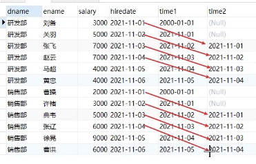
>
>```sql
>-- LEAD(expr[,N[,default]])的用法  -- 向前 
>SELECT 
>dname,ename,salart,hiredate,
>lead(hiredate,1,'2000-01-01') over(PARTITION by dname ORDER BY hiredate desc) as time1,
>lead(hiredate,2) over(PARTITION by dname ORDER BY hiredate desc) as time2
>from employee;
>
>```
>
>**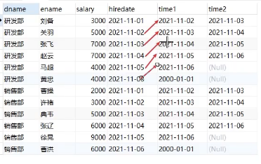**


### 5.头尾函数

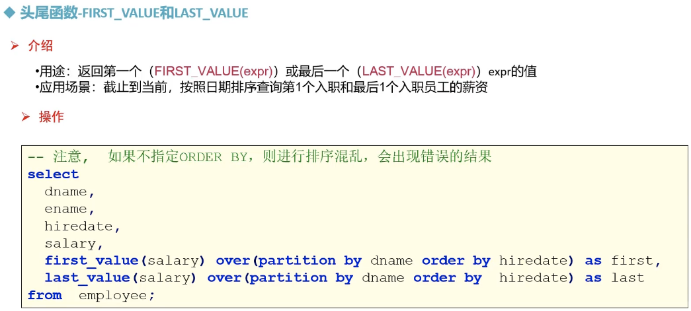

>```sql
>-- 头尾函数 
>SELECT
> dname,
> ename,
> hiredate,
> salart,
> FIRST_VALUE(salart) over(PARTITION by dname ORDER BY hiredate) as first,
> LAST_VALUE(salart) over (PARTITION by dname ORDER BY hiredate) as last 
>from employee; 
>
>```
>
>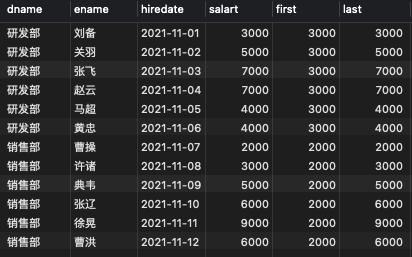
>
>

### 6.其他函数 

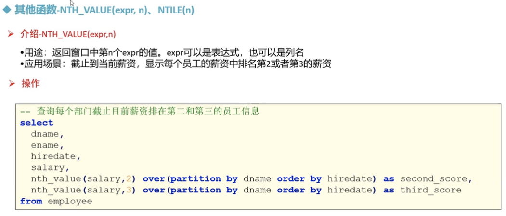

>```sql
>-- 其他函数 
>-- 查询每个部门截止目前(说明按照date排序)薪资排在第二和第三的员工信息*(按照入职日期排的)
>SELECT
> dname,
> ename,
> hiredate,
> salart,
> NTH_VALUE(salart,2) over(PARTITION by dname ORDER BY hiredate) as second_sal,
> NTH_VALUE(salart,3) over(PARTITION by dname ORDER BY hiredate) as third_sal
>from employee;
>
>
>```
>
>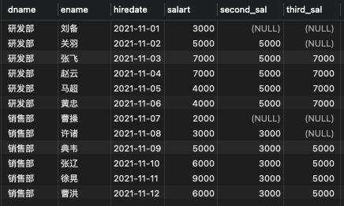
>
>

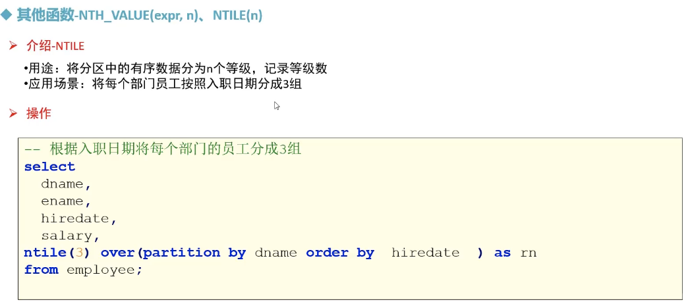

>```sql
>-- NTILE(N) 根据入职日期将每个部门的员工分成3组 
>SELECT
> dname,
> ename,
> hiredate,
> salart,
> NTILE(3) over(PARTITION by dname ORDER BY hiredate) as nt,
> NTILE(4) over(PARTITION by dname ORDER BY hiredate) as nt
>
>from employee;
>
>-- 分组取样等级=1的员工信息
>SELECT * from 
>(SELECT
> dname,
> ename,
> hiredate,
> salart,
> NTILE(3) over(PARTITION by dname ORDER BY hiredate) as nt
>from employee
>) t
>where t.nt =1;
>```
>
>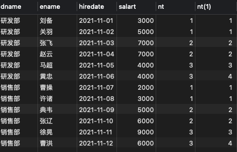
>
>


