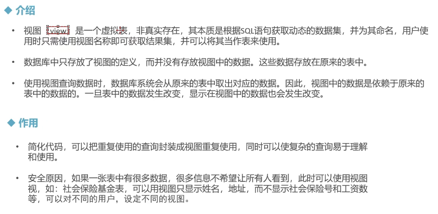
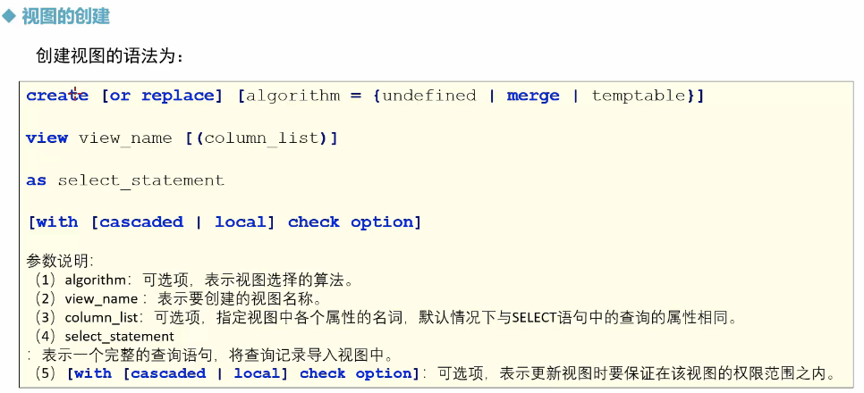
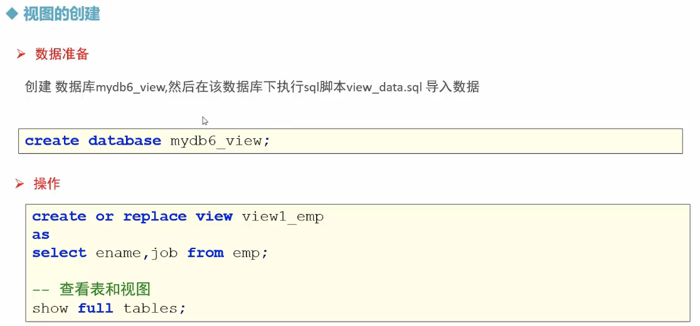
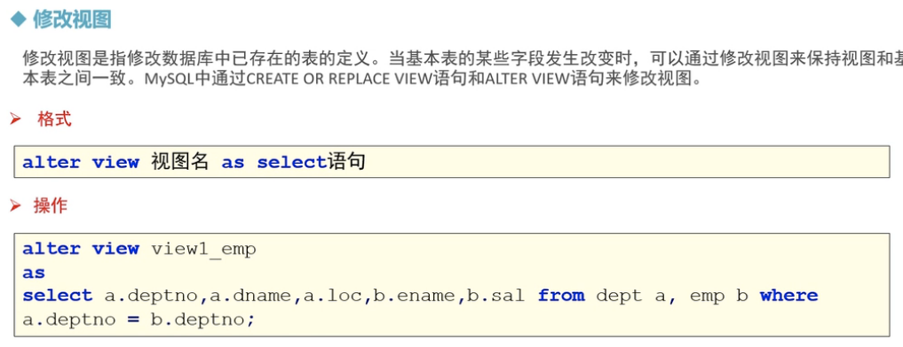
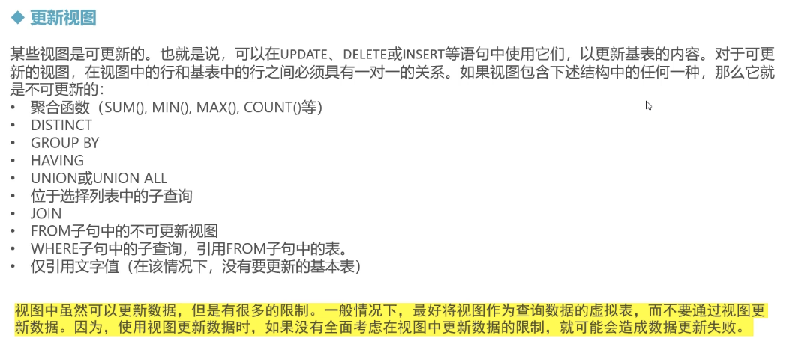
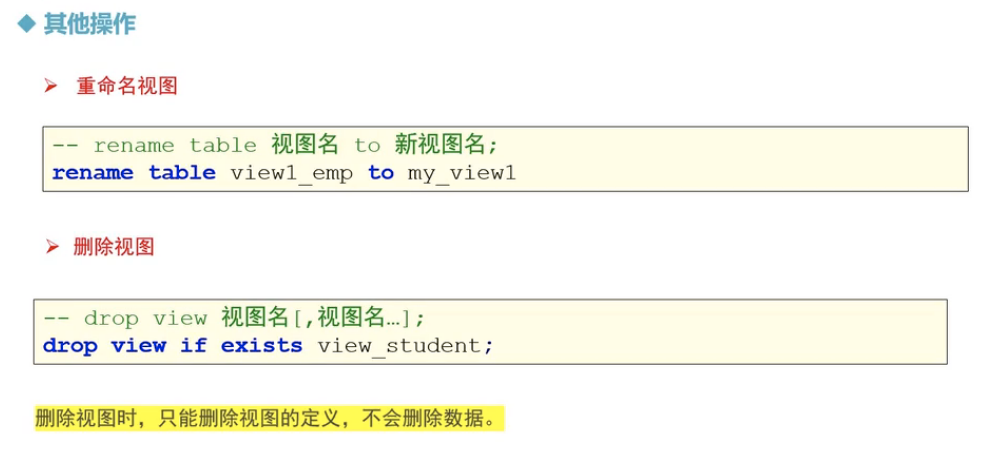

# MySQL 的视图



##  MySQL 视图 - 创建视图





> ```sql
> -- 创建视图 
> CREATE or REPLACE view view_emp 
> as 
> SELECT ename, job from emp;
> 
> 
> -- 查看表和视图
> show tables;
> show full tables;
> 
> # view 只是纪录了数据的逻辑。
> #  原表数据发生变化，视图对应的数据也会发生变化 
> SELECT * from view_emp;
> ```
>
> 


## 修改视图



> ```sql
> ALTER view view_emp
> AS
> SELECT a.deptno, a.dname, a.loc, b.ename, b.sal
> from dept a, emp b
> where a.deptno = b.deptno;
> 
> SELECT * from view_emp;
> ```


## 更新视图



> ```sql
> # 这里已经将原数据修改了 
> UPDATE view_emp set ename = 'xxxxx' where ename = 'simth';
> 
> INSERT into view_emp VALUES('bbbbb','clerk'); -- 插入失败。，
> 
> ```
>
> ```sql
> 
> -- --- 视图包含聚合函数的不能更新 ---- 
> CREATE or REPLACE view view2_emp 
> as 
> SELECT count(*) as c from emp;
> 
> SELECT * from view2_emp;
> 
> INSERT into view2_emp VALUES(100); --  插入失败 
> UPDATE view2_emp set c = 100; --  修改失败
> 
> 
> -- ------视图包含distinct的不可更新 
> CREATE or REPLACE view view3_emp 
> as 
> SELECT DISTINCT job from emp;
> 
> SELECT * from view3_emp;
> 
> -- ------ 视图包含 group by, having, union, union all, 子查询, join, 常量文字值， 均不可更新 ---- 
> 
> 
> ```
>
> 

## 重命名/删除视图



> ```SQL
> # 重命名 
> rename table view_emp to my_view1;
> # 删除视图 
> drop view if EXISTS view2_emp;
> ```
>
> 


## 练习/总结

```sql
--  1.查询部门平均薪水最高的部门名称 
SELECT
	b.dname,
	a.deptno,
	ROUND( AVG( sal ), 3 )
FROM
	emp a
	INNER JOIN dept b ON a.deptno = b.deptno 
GROUP BY
	a.deptno 
ORDER BY
	ROUND( AVG( sal ), 3 ) DESC 
	LIMIT 1;
	
# VIEW 从emp 中计算各部门平均薪资，然后和dept联合显示结果 
SELECT
	a.dname,
	a.deptno,
	a.loc,
	ttt.avg_sal 
FROM
	dept a, test3 ttt 
WHERE
	a.deptno = ttt.deptno;

# 使用视图 
CREATE or replace view test1
as 
SELECT deptno, ROUND( AVG( sal ), 3 ) as avg_sal FROM emp GROUP BY deptno;

CREATE or REPLACE view test2
as SELECT *, RANK() over ( ORDER BY avg_sal DESC ) AS rn FROM test1 t; 

CREATE or REPLACE view test3 
as SELECT * FROM test2 tt WHERE rn = 1;


-- 2. 查询员工比所属领导薪资高的部门名，员工名，员工领导编号 
-- 2.1 查询员工比领导高的部门号 

CREATE or replace view test21 
as 
SELECT
	a.deptno,
	a.ename ename,
	a.sal esal,
	b.ename mgrname,
	b.sal msal,
	b.empno m_empno
FROM
	emp a,
	emp b 
WHERE
	a.mgr = b.empno 
	AND a.sal > b.sal;

-- 2.2. 将2.1查询的部门号和部门表进行联表查询 

SELECT
	a.dname,
	b.ename,
	b.m_empno 
FROM
	dept a
	JOIN test21 b ON a.deptno = b.deptno;
	

-- 3. 查询工资等级为4级， 1980年以后入职的工作地点为dallas的员工编号，姓名，和工资， 并查询薪资在前三名的员工信息

-- 3.1 需求1:
CREATE or replace view test5
as
SELECT
	a.deptno,
	a.dname,
	a.loc,
	b.empno,
	b.ename,
	b.sal,
	c.grade
FROM
	dept a
	JOIN emp b ON a.deptno = b.deptno and year(b.hiredata) > '1980' and a.loc = 'dallas'
	JOIN salgrade c ON grade = 4 
	AND (b.sal BETWEEN c.losal AND c.hisal);
	
SELECT *
FROM
(
SELECT *,
RANK() over(ORDER BY sal desc) rn
from test5
) t
where rn <=3;
;
	

```

