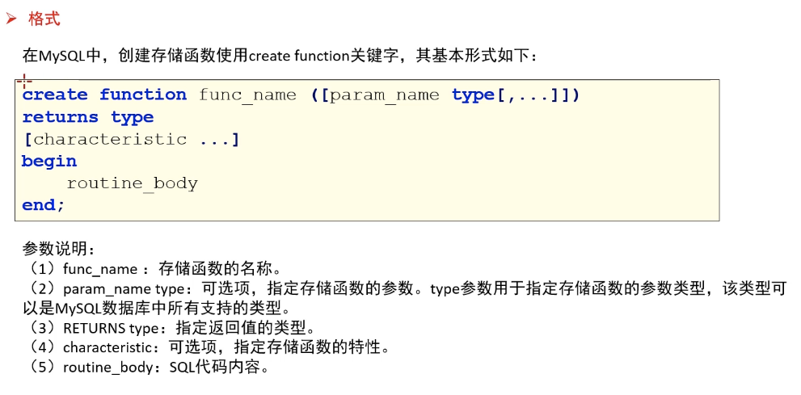
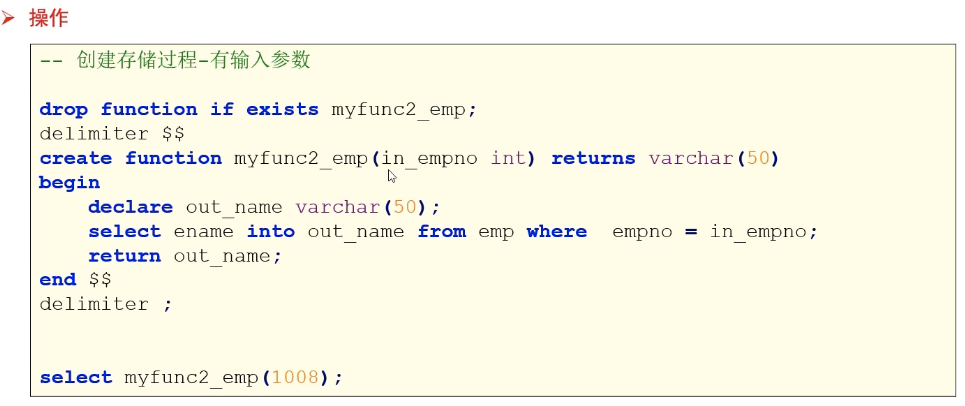

# MySQL的存储函数 





> ```sql
> CREATE DATABASE if not EXISTS mydb9;
> use mydb9;
> 
> -- 允许创建函数权限信任 
> set GLOBAL log_bin_trust_function_creators = TRUE;
> 
> --  创建存储函数 -- 没有参数
> drop FUNCTION if EXISTS myfunc1_emp;
> 
> delimiter $$
> CREATE FUNCTION myfunc1_emp() RETURNS int 
> BEGIN
> 	--  定义局部变量
> 	DECLARE cnt int DEFAULT 0;
> 	SELECT count(*) into cnt from emp;
> 	RETURN cnt;
> END $$
> delimiter ;
> 
> -- 调用存储函数 
> SELECT myfunc1_emp();
> 
> 
> 
> 
> --  创建存储函数 -- ➡有输入参数 
> -- 需求：传入员工编号。返回员工的名字
> drop FUNCTION if EXISTS myfunc2_emp;
> delimiter $$
> CREATE FUNCTION myfunc2_emp(in_empno int)
> RETURNS VARCHAR(50)
> BEGIN
> 	DECLARE out_ename VARCHAR(50);
> 	SELECT ename into out_ename from emp where empno = in_empno;
> 	return out_ename;
> END $$
> delimiter ;
> 
> SELECT myfunc2_emp(1001),myfunc2_emp(1008);
> 
> ```
>
> 
