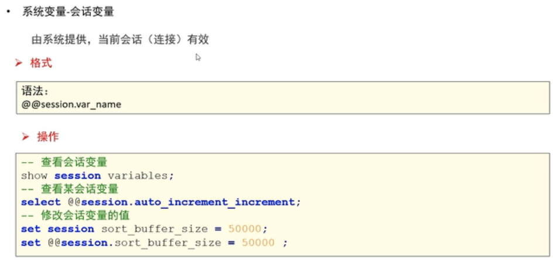

# MySQL的存储过程


## 存储过程-入门案例


> ```sql
> ```
>
> 


## 存储过程-变量定义

----

###  局部变量 


> ```sql
> delimiter $$
> CREATE PROCEDURE proc02()
> BEGIN
>    DECLARE var_name01 VARCHAR(20) DEFAULT 'aaa';  -- 声明/定义变量 
> 	SET var_name01 = 'zhangsan';   -- 给变量赋值 
> 	SELECT var_name01;  -- 输出变量值 
> END $$ 
> delimiter ;
> 
> call proc02(); -- 这里输出“zhangsan”
> 
> 
> ```


> ```sql
> delimiter $$
> CREATE PROCEDURE proc03()
> BEGIN
>  DECLARE my_ename VARCHAR(20);  -- 声明/定义变量 
>  SELECT ename into my_ename from emp where empno = 1001;
>  SELECT my_ename;
> END $$ 
> delimiter ;
> 
> call proc03();
> ```

----

### 用户变量 


> ```sql
> -- 用户变量 
> delimiter $$
> CREATE PROCEDURE proc04()
> BEGIN
> 	set @var_name02 = 'beijing';
> 	SELECT  @var_name02;
> END $$
> delimiter ;
> call proc04();
> 
> 
> SELECT  @var_name02; -- 也可以使用用户变量，外部可以使用 
> 
> ```
>
> 

---

### **系统变量** 


> ```sql
> use mydb7_procedure;
> show GLOBAL variables;
> #  查看某个全局变量 
> SELECT @@global.auto_increment_increment;
> -- 修改全局变量的值
> SELECT @@global.sort_buffer_size;
> set GLOBAL sort_buffer_size = 40000;
> set @@global.sort_buffer_size = 262144;
> SELECT @@global.sort_buffer_size;
> ```
>
> 



> ```sql
> 
> -- 查看会话变量 
> show session variables;
> -- 查看某会话变量 
> SELECT @@session.auto_increment_increment; 
> -- 修改会话变量的值
> SELECT @@session.sort_buffer_size;
> set session sort_buffer_size = 40000;
> set @@session.sort_buffer_size = 362144;
> 
> SELECT @@session.sort_buffer_size;
> 
> ```
>
> 


## MySQL存储过程 -- 参数传递  

### 传参-in


> ```sql
> -- 定义存储的过程
> delimiter $$ 
> CREATE PROCEDURE proc06(in param_empno VARCHAR(20))
> BEGIN
> 	SELECT * FROM emp WHERE empno = param_empno;
> END $$
> delimiter ;
> 
> -- 调用函数，并且传参输出结果
> CALL proc06('1002');
> 
> 
> -- 通过传入（多个参数） 部门名 和 薪资，并且薪资大于指定值的员工信息 
> delimiter $$
> CREATE PROCEDURE proc07 (in param_dname VARCHAR(50), in param_sal decimal(7,2)) 
> BEGIN
> 	SELECT
> 		* 
> 	FROM
> 		dept a,
> 		emp b 
> 	WHERE
> 		a.deptno = b.deptno 
> 		AND a.dname = param_dname
> 		AND b.sal > param_sal;
> END $$
> delimiter;
> 
> CALL proc07('research', 20000);
> CALL proc07('accounting', 10000);
> ```
>
> 

---

### 传递参数 - out


>```sql
>-- ------------传递参数 - out -------------------- 
>use mydb7_procedure;
>-- 封装有参数的存储过程，传入员工编号，返回员工名字 
>delimiter $$
>CREATE PROCEDURE proc09(in in_empno int, out out_ename VARCHAR(50))
>BEGIN 
>	SELECT ename into out_ename from emp where empno = in_empno; 
>END $$ 
>delimiter ; 
>
>CALL proc09(1001, @o_ename);
>SELECT @o_ename;
>
>CALL proc09(1002, @o_ename);
>SELECT @o_ename;
>
>-- --------------------------------------------------
>-- 封装有参数的存储过程，传入员工编号，返回员工名字和薪资 
>delimiter $$
>CREATE PROCEDURE proc10(in in_empno int, out out_ename VARCHAR(50),out out_sal decimal(7,2))
>BEGIN 
>	SELECT ename,sal into out_ename,out_sal 
>	from emp 
>	where empno = in_empno; 
>END $$ 
>delimiter ; 
>
>CALL proc10(1002, @o_ename, @o_sal);
>SELECT @o_ename, @o_sal;
>```
>
>

---

### 传递参数 - inout


>```sql
>-- ------------传递参数 - inout -------------------- 
>-- 传入一个数字 ，传出这个数字的是10倍值 
>delimiter $$
>CREATE PROCEDURE proc11(INOUT num int )
>BEGIN
>	set num = num * 10;
>END $$
>delimiter ; 
>
>set @inout_num = 300;
>call proc11(@inout_num);
>
>SELECT @inout_num;  -- 输出 3000
>
>```
>
>
>
>```sql
>-- 传入员工名，拼接部门号，传入薪资，求出年薪 
>delimiter $$
>CREATE PROCEDURE proc12(inout io_ename VARCHAR(50), inout io_sal int)
>BEGIN
>	SELECT concat_ws('_',deptno, ename) into io_ename from emp where ename = io_ename;
>	set io_sal = io_sal*12;
>END $$
>delimiter ; 
>
>set @inout_ename = 'allen';
>set @inout_sal = 3000;
>call proc12(@inout_ename, @inout_sal);
>SELECT @inout_ename, @inout_sal;
>```
>
>


##  mysql存储过程 - 流程控制 

---

###  **判断 - 分支 - if** 


> ```sql
> -- 存储过程 - if 
> -- 案例1 
> -- 输入学生的成绩 ，来判断成绩的级别 
> /*
> score < 60, fail 
> score >=60 and score <80; pass 
> score >=80 and score <90; good 
> score >=90 and score <= 100:  excellent 
> score > 100 or score <0 input error
> 
> */
> delimiter $$
> CREATE PROCEDURE proc13(in score int)
> BEGIN
> 	if score < 60 and score >=0
> 		then SELECT 'fail';
> 	elseif score>= 60 and score<80
> 		then SELECT 'pass';
> 	ELSEIF score >=80 and score <90
> 		then SELECT 'good';
> 	ELSEIF score >=90 and score <=100
> 		then SELECT 'excellent';
> 	else 
> 		SELECT 'input error';
> 	end IF;
> END $$
> delimiter ;
> 
> set @score =88;
> call proc13(@score);
> call proc13(100);
> ```
>
> ```sql
> -- 输入员工的名字，判断工资的情况
> /*
> sal < 10000: new guy 
> sal >= 10000 and sal <20000: normal guy 
> sal >= 2000: old guy 
> 
> */ 
> delimiter $$
> CREATE PROCEDURE proc14(in in_ename VARCHAR(20))
> BEGIN
> 	DECLARE var_sal DECIMAL(7,2);
> 	DECLARE res VARCHAR(20);
> 	SELECT sal into var_sal from emp where ename = in_ename; 
> 	
> 	if var_sal < 10000
> 		then 
> 			set res = 'new guy!';
> 	elseif var_sal<20000
> 		then 
> 			set res = 'normal guy!';
> 	else 
> 		set res = 'old guy!';
> 	end if;
> 	
> 	SELECT res;
> 	
> END $$
> delimiter ;
> 
> CALL proc14('simth');
> CALL proc14('scott');
> CALL proc14('allen');
> ```

---

###  流程控制-判断-分支-case


> ```sql
> -- 流程控制语句： case 
> /*
> pay method:
> 	1. wechat 
> 	2. alipay 
> 	3. credit card 
> 
> */
> -- 格式1 
> delimiter $$
> CREATE PROCEDURE proc15_case(in pay_type int)
> BEGIN 
> 	CASE pay_type
> 	WHEN 1 THEN SELECT 'wechat';
> 	when 2 THEN SELECT 'alipay';
> 	when 3 then SELECT 'credit card';
> 	ELSE
> 		SELECT 'others';
> 	END CASE;
> END $$
> delimiter ;
> 
> CALL proc15_case(2);
> 
> CALL proc15_case(5);
> ```
>
> ```sql
> -- 格式2 
> delimiter $$
> CREATE PROCEDURE proc16_case(in score int)
> BEGIN
> 	CASE 
> 	WHEN score < 60 and score >=0 THEN
> 		SELECT 'fail';
> 	WHEN score>= 60 and score<80 THEN
> 		SELECT 'pass';
> 	WHEN score >=80 and score <90 THEN
> 		SELECT 'good';
> 	WHEN score >=90 and score <=100 THEN
> 		SELECT 'excellent';
> 	ELSE
> 		SELECT 'input error';
> END CASE;
> end $$
> delimiter ;
> 
> call proc16_case(110);
> call proc16_case(90);
> 
> ```

---

###  流程控制 - 循环 - while ... do -/ repeat...until... -/ loop 


>  ```sql
>  -- 创建测试表 
>  
>  CREATE TABLE if not EXISTS user(
>    uid int PRIMARY key,
>  	username VARCHAR(50),
>  	PASSWORD VARCHAR(50)
>  );
>  
>  -- 流程控制 - 循环 
>  -- 需求：向表中添加 指定 条数的数据， 插入 
>  --  ----- 存储过程-循环 - while 
>  
>  delimiter $$ 
>  CREATE PROCEDURE proc17_while (in insertCount int)
>  BEGIN
>  	DECLARE i int DEFAULT 1;
>  	label_abc:while i <= insertCount do 
>  		INSERT INTO user(uid, username, PASSWORD)
>  		VALUES (i, CONCAT('user-',i), '123456' );
>  		set i = i+1;
>  	end while label_abc; 
>  END $$
>  delimiter ;
>  
>  call proc17_while(10);
>  
>  
>  ```
>
> ```sql
> --  ----- 存储过程-循环控制 - while + leave 
> -- leave 跳出当前层的代码while循环
> TRUNCATE table user;
> 
> delimiter $$
> CREATE PROCEDURE proc17_while_leave ( IN insertCount INT ) BEGIN
> 	DECLARE
> 		i INT DEFAULT 1;
> 	label :
> 	WHILE
> 			i <= insertCount DO
> 			INSERT INTO USER ( uid, username, PASSWORD )
> 			VALUES ( i, CONCAT( 'user-', i ), '123456' );
> 			
> 			if i=5 then 
> 				leave label; -- 跳出label对应的while的循环 
> 			end if;
> 			
> 			SET i = i + 1;
> 	END WHILE label;
> 	
> END $$
> delimiter ;
> 
> call proc17_while_leave(10);
> 
> ```
>
> ```sql
> --  ----- 存储过程-while + iterate
> -- iterate 跳过本次循环的剩余代码，进入下一次循环
> use mydb7_procedure;
> TRUNCATE table user2;
> 
> delimiter $$
> CREATE PROCEDURE proc17_while_iterate ( IN insertCount INT ) BEGIN
> 	DECLARE
> 		i INT DEFAULT 1;
> 	label :
> 	WHILE
> 			i <= insertCount DO
> 			SET i = i + 1;
> 			
> 			if i=5 then   --  跳过 i = 5
> 				ITERATE label;
> 			end if;
> 			
> 			
> 			INSERT INTO user2 ( uid, username, PASSWORD )
> 			VALUES ( i, CONCAT( 'user-', i ), '123456' );
> 			
> 	END WHILE label;
> 	SELECT 'end while otside';
> 	
> END $$
> delimiter ;
> 
> call proc17_while_iterate(10);
> ```
>
> 


> ```sql
> 
>  delimiter $$
>  CREATE PROCEDURE proc18_repeat(in insertCount int)
>  BEGIN
> 		DECLARE i int DEFAULT 1;
> 		label: REPEAT
> 			insert into user (uid, username, PASSWORD) 
> 			VALUES (i, CONCAT('user-',i), '123456');
> 			set i = i+1;
> 			UNTIL i > insertCount
> 		end REPEAT label;
> 		SELECT 'end repeat process';
>  END $$
>  delimiter ;
>  
>  call proc18_repeat(10);
> ```
>
> 


> ```sql
> -- 循环 loop 
> use mydb7_procedure;
> TRUNCATE table user;
> 
> delimiter $$
> CREATE PROCEDURE proc19_loop(in insertCount int)
> BEGIN
> 	DECLARE i int DEFAULT 1;
> 	label: loop
> 	
> 		insert into user(uid,username, PASSWORD)
> 		VALUES(i, CONCAT('user-',i), '123456');
> 		set  i = i+1;
> 		
> 		if i > insertCount 
> 			then
> 				leave label;
> 		end if;
> 	end loop label;
> end $$
> delimiter ;
> 
> call proc19_loop(20);
> ```
>
> 


##  MySQL存储过程-游标


> ```sql
> -- 操作游标 
> use mydb7_procedure;
> drop PROCEDURE if EXISTS proc20_cursor;
> -- 需求：输入一个部门名。查询该部门员工的编号，名字，薪资, 将查询的结果添加游标
> delimiter $$ 
> CREATE PROCEDURE proc20_cursor(in in_dname VARCHAR(50))
> BEGIN
> 	-- 定义局部变量 
> 	DECLARE var_empno int;
> 	DECLARE var_ename VARCHAR(50);
> 	DECLARE var_sal DECIMAL(7,2);	
> 	
> 	-- 声明游标
> 	DECLARE my_cursor CURSOR for 
> 		SELECT empno, ename, sal
> 		from dept a, emp b 
> 		where a.deptno = b.deptno and a.dname = in_dname;
> 	-- 打开游标
> 	OPEN my_cursor;
> 	
> 	-- 通过游标获取值
> 	label: loop
> 		FETCH my_cursor into var_empno, var_ename, var_sal;
> 		SELECT var_empno, var_ename, var_sal;
> 	end loop label;
> 
> 	-- 关闭游标
> 	close my_cursor;
> 
> END $$;
> delimiter ; 
> 
> call proc20_cursor('sales');
> ```
>
> 


## MySQL存储过程-异常处理 


> ```sql
>  
> -- 游标 + 句柄handler 
> use mydb7_procedure;
> drop PROCEDURE if EXISTS proc21_cursor_handler;
> -- 需求：输入一个部门名。查询该部门员工的编号，名字，薪资, 将查询的结果添加游标
> delimiter $$ 
> CREATE PROCEDURE proc21_cursor_handler(in in_dname VARCHAR(50))
> BEGIN
> 	-- 定义局部变量 
> 	DECLARE var_empno int;
> 	DECLARE var_ename VARCHAR(50);
> 	DECLARE var_sal DECIMAL(7,2);	
> 	
> 	-- 定义标记值 
> 	DECLARE flag int DEFAULT 1;
> 	
> 	-- 声明游标
> 	DECLARE my_cursor CURSOR for 
> 		SELECT empno, ename, sal
> 		from dept a, emp b 
> 		where a.deptno = b.deptno and a.dname = in_dname;
> 		
> 	-- 定义句柄： 定义异常的处理方式 
> 	/*
> 	1. 异常处理完之后程序该如何执行 
> 		 continue： 继续执行剩余代码 
> 		 exit： 直接终止程序 
> 		 undo； mysql目前不支持 
> 		 
> 	2. 触发条件
> 		条件码：
> 			1329，... 
> 		条件名：
> 			SQLWARNING
> 			NOT FOUND 
> 			SQLEXCEPTION
> 			
> 	3. 异常触发之后执行什么代码
> 			设置flag 的值进行判断 
> 	*/
> 	DECLARE continue HANDLER 
> 		FOR 1329
> 		set flag = 0;
> 		
> 	-- 打开游标
> 	OPEN my_cursor;
> 	
> 	-- 通过游标获取值
> 	label: loop
> 		FETCH my_cursor into var_empno, var_ename, var_sal;
> 		
> 		-- 判断flag， 如果flag =1 执行，否则不执行 
> 		if flag = 1 then 
> 			SELECT var_empno, var_ename, var_sal;
> 		else
> 			leave label;
> 		end if;
> 	end loop label;
> 	-- xxxx
> 	-- 关闭游标
> 	close my_cursor;
> 
> END $$;
> delimiter ; 
> 
> call proc21_cursor_handler('sales');
> call proc21_cursor_handler('accounting');
> call proc21_cursor_handler('research');
> 
> 
> ```
>
> 


## 练习


> ```sql
> drop DATABASE if EXISTS mydb18;
> CREATE DATABASE if not EXISTS mydb18;
> use mydb18;
> 
> 
> drop PROCEDURE if EXISTS proc188;
> 
> delimiter $$
> CREATE PROCEDURE proc188()
> BEGIN
> 	DECLARE next_year int;  -- 下一月的年份 
> 	DECLARE next_month int; -- 
> 	DECLARE next_month_day int; --  下个月最后it
> 	
> 	DECLARE next_month_str char(2);
> 	DECLARE next_month_day_str char(2);
> 	
> 	-- 处理每天的表名 
> 	DECLARE table_name_str varchar(10); 
> 	DECLARE t_index int DEFAULT 1;
> 	
> 	-- 获取下一个月的年份 
> 	set next_year = year(DATE_ADD(now(),INTERVAL 1 month)); -- 2022
> 	-- 获取下一个月是几月 
> 	set next_month = MONTH(DATE_ADD(now(),INTERVAL 1 month));  -- 4
> 	-- 下个月最后一天是几号 
> 	set next_month_day = DAYOFMONTH(LAST_DAY(DATE_ADD(now(),INTERVAL 1 month))); -- 30
> 	
> 	if next_month < 10
> 		then SET next_month_str = CONCAT('0',next_month);
> 	else 
> 		SET next_month_str = CONCAT('',next_month);
> 	end if;
> 	 
> 	while t_index < next_month_day do 
> 		if (t_index) < 10
> 			then set next_month_day_str = CONCAT('0',t_index);  -- 1-->01
> 		else 
> 			set next_month_day_str = CONCAT('',t_index);
> 		end if;
> 		
> 		set table_name_str = CONCAT(next_year,'_', next_month_str,'_', next_month_day_str);
> 		
> 		-- 拼接create sql 语句 
> 		set @create_table_sql = CONCAT(
> 				'create table user_',
> 				table_name_str,
> 				'(`uid` INT, `ename` VARCHAR(50), `information` VARCHAR(50)) COLLATE=\'utf8_general_ci\' 
> 				ENGINE=INNODB');
> 		
> 		-- from 后面不能使用局部变量 
> 		-- 预编译/预处理 
> 		PREPARE create_table_stmt from @create_table_sql;
> 		-- 执行编译之后的create_table_stmt
> 		EXECUTE create_table_stmt;
> 		-- 释放预编译
> 		DEALLOCATE PREPARE create_table_stmt;
> 		
> 		set t_index = t_index+1;
> 	end WHILE;
> END $$
> delimiter ;
> 
> 
> CALL proc188();
> 
> 
> ```


## 存储过程-总结 

### 作用

>1. 代码重用
>2. 速度快，只有首次执行需要编译和优化步骤，后续可以直接被调用执行
>
>


