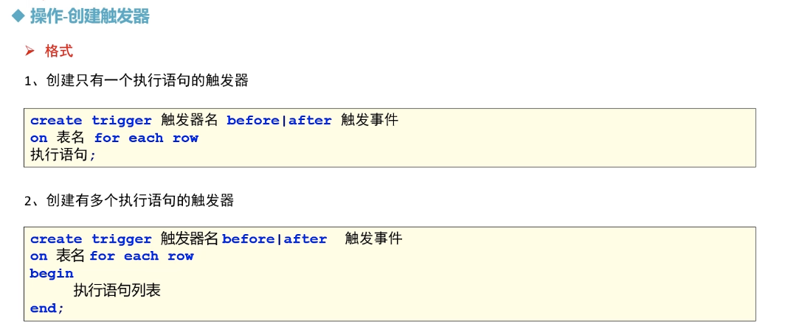

# MySQL触发器


##  操作-创建触发器




> ```sql
> -- 如果触发器存在，则先删除
> drop TRIGGER if EXISTS triger_test1;
> -- 需求1: 当用户表添加一行数据，则会自动会在user_logs添加日志记录 
> -- 定义触发器； triger_test1 
> 
> CREATE TRIGGER triger_test1 AFTER insert 
> ON user for each row 
> INSERT into user_logs VALUES (NULL, NOW(), 'new user has been added!');
> 
> 
> -- 
> INSERT INTO user VALUES (1,'allen','12312312');
> INSERT INTO user 
> VALUES (2,'scott','2122212312'), 
> 			(3,'hankin','2122212312');
> 
> -- 需求2: 当用户表数据被修改的时候，添加一条修改日志user_logs
> drop TRIGGER if EXISTS triger_test2;
> delimiter $$
> CREATE TRIGGER triger_test2 BEFORE UPDATE 
> ON user for each row
> BEGIN
> 	INSERT into user_logs VALUES (NULL, NOW(), '有用户信息被修改');
> 	
> END $$
> delimiter ;
> 
> -- 在user表中修改数据，让触发器自动执行 
> UPDATE user set password = '88888' where uid = 1;
> 
> ```
>
> 

## 操作- NEW 与 OLD


> ```SQL
> -- NEW and OLD 
> -- insert 类型的触发器 - NEW 
> drop TRIGGER if EXISTS triger_test3;
> 
> -- 定义触发器； triger_test1 
> 
> CREATE TRIGGER triger_test3 AFTER insert 
> ON user for each row 
> INSERT into user_logs 
> VALUES 
> (NULL, NOW(), CONCAT_ws(', ','new user has been added! details: ', NEW.uid, NEW.username, NEW.password));
> 
> 
> INSERT INTO user VALUES (5,'XXX','123456');
> 
> 
> 
> -- update 类型的触发器 
> -- old 
> CREATE TRIGGER triger_test4 AFTER UPDATE 
> ON user for each row 
> INSERT into user_logs 
> VALUES 
> (NULL, NOW(), CONCAT_ws('-','User account infos has been updated; details: ', OLD.uid, OLD.username, OLD.password));
> 
> UPDATE user set password ='0000000' where uid = 4;
> 
> -- new 
> CREATE TRIGGER triger_test5 AFTER UPDATE 
> ON user for each row 
> INSERT into user_logs 
> VALUES 
> (NULL, NOW(), CONCAT_ws('-','User account infos has been updated; details: ', NEW.uid, NEW.username, NEW.password));
> 
> UPDATE user set password ='22222222' where uid = 1;
> 
> 
> -- DELETE 类型的触发器 
> -- OLD 
> DROP TRIGGER IF EXISTS triger_test6;
> CREATE TRIGGER triger_test6 AFTER DELETE 
> ON user for each row 
> INSERT into user_logs 
> VALUES 
> (NULL, NOW(), CONCAT_ws('-','user account has been DELETE; details: ', OLD.uid, OLD.username, OLD.password));
> 
> DELETE FROM user where uid = 4;
> ```
>
> 

## 触发器的其他操作


## 触发器-注意事项


