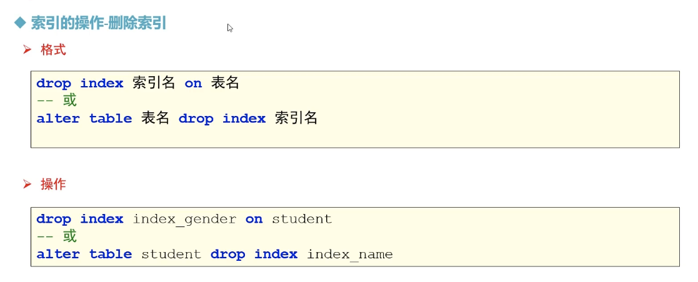
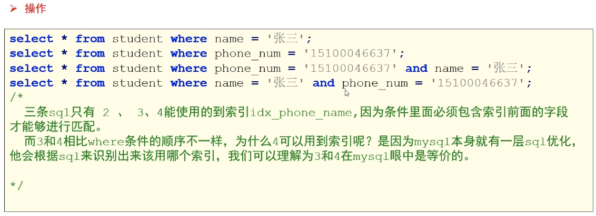

# MySQL-索引


> hash 索引，相当一种映射的函数，
>
> hash冲突：


##  索引的操作 - 创建索引 - 单列索引 - 普通索引


> 
>
> ```sql
> -- 方式1: 创建表的时候直接指定 
> CREATE TABLE if not EXISTS student(
> 	sid int PRIMARY KEY,
> 	card_id VARCHAR(20),
> 	gender VARCHAR(20),
> 	name VARCHAR(20),
> 	age int,
> 	birth date,
> 	phone_num VARCHAR(20),
> 	score double,
> 	index index_name(name)  -- 给 name 列创建索引
> 	
> );
> 
> SELECT * from student where name = 'jones';
> 
> -- 方式2: 直接创建 
> CREATE index index_gender on student(gender);
> 
> -- 方式3: 通过修改表结构（添加索引 ）
> ALTER TABLE student add index index_age(age);
> 
> 
> ```
>
> 

> 
>
> 
>
> 
>
> ```sql
> -- 1、查看数据库所有的索引
> SELECT * from mysql.`innodb_index_stats` a WHERE a.`database_name` = 'mydb5';
> 
> -- 2、查看表中所有的索引 
> SELECT * from mysql.`innodb_index_stats` a WHERE a.`database_name` = 'mydb5'
> and a.table_name like '%student%';
> 
> -- 3.查看表中所有的索引 
> SHOW index from student;
> ```
>
> 

> 


##  索引的操作 - 创建索引 - 单列索引 - 唯一索引


> 
>
> ```sql
> -- 唯一索引 
> -- 方式1: 创建表的时候直接指定 
> CREATE TABLE if not EXISTS student2(
> 	sid int PRIMARY KEY,
> 	card_id VARCHAR(20),
> 	gender VARCHAR(20),
> 	name VARCHAR(20),
> 	age int,
> 	birth date,
> 	phone_num VARCHAR(20),
> 	score double,
> 	unique index_card_id(card_id) -- 给 card_id 列创建索引
> );
> 
> 
> -- 方式2: 直接创建
> drop index index_card_id on student2;
> CREATE unique index index_card on student2(card_id);
> 
> -- 方式3: 通过修改表结构（添加索引 ）
> ALTER TABLE student2 add UNIQUE index_phone_num(phone_num);
> ```
>
> ```sql
> ```
>
> 


##  索引的操作 - 创建索引 - 单列索引 - 主键索引


> ```sql
> -- 创建主键，自动添加主键索引-不可以为null， 是一种特殊的唯一索引
> ```
>
> 

----


## 索引的操作 - 创建索引 - 组合索引


> ```sql
> --  组合索引，既可以是普通索引，也可以是唯一索引 
> -- 创建组合普通索引 
> CREATE index index_phone_name on  student(phone_num,name);
> -- 
> drop index index_phone_name on  student;
> 
> -- 创建组合唯一索引 
> CREATE unique index index_phone_name on  student(phone_num,name);
> 
> /*
> 1 a 
> 2 b 
> 2 a 
> 1 a 不行 
> */
> 
> ```
>
> 


## 索引的操作 - 创建索引 - 全文索引


> 
>
> 
>
> 
>
> 
>
> ```sql
> -- 使用全文索引 
> SELECT * from t_article WHERE MATCH(content) against('yo');
> SELECT * from t_article WHERE MATCH(content) against('you');
> SELECT * from t_article WHERE content like '%you%';
> 
> /*
> 全文索引有两个 变量， 最小搜索长度 和 最大搜索长度 
> */
> SHOW VARIABLES like '%ft%';
> -- mysql 存储引擎是 innodb
> 
> ```
>
> 


## 索引的操作 - 创建索引 - 空间索引


> 
>
> ```sql
> CREATE TABLE if not EXISTS shop_info(
> 	id int PRIMARY KEY auto_increment COMMENT 'id',
> 	shop_name VARCHAR(64) not NULL COMMENT '门店名称',
> 	goem_point geometry not null COMMENT '经纬度',
> 	spatial key geom_index(goem_point) 
> );
> 
> ```
>
> 


# 索引的原理

## 索引的原理


##  索引的原理 - 相关的算法

 


## 大部分数据库系统都采用的是B+TREE


> B + TREE 
>
> 叶子节点为双向链表


## 索引的特点


## 索引---使用原则


## 总结 - 验证


