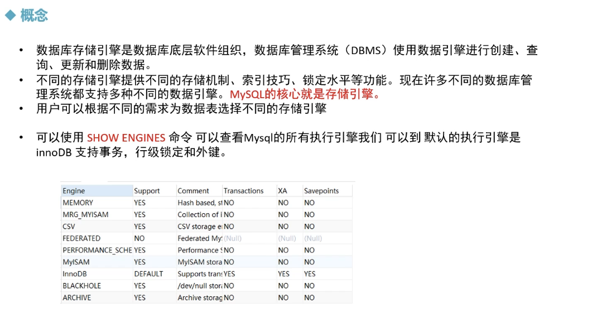
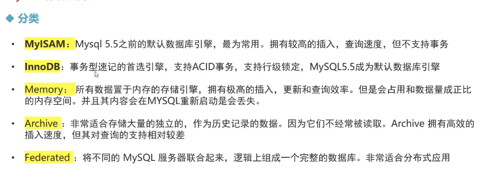
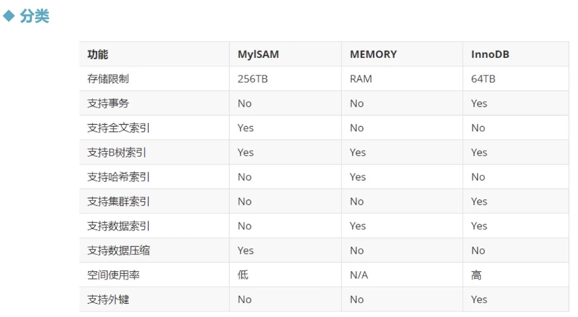
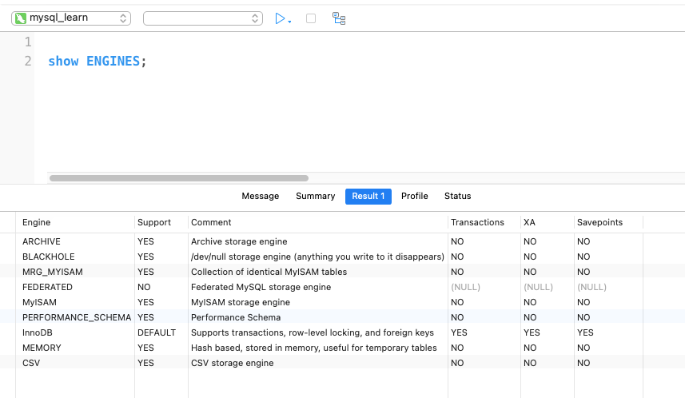
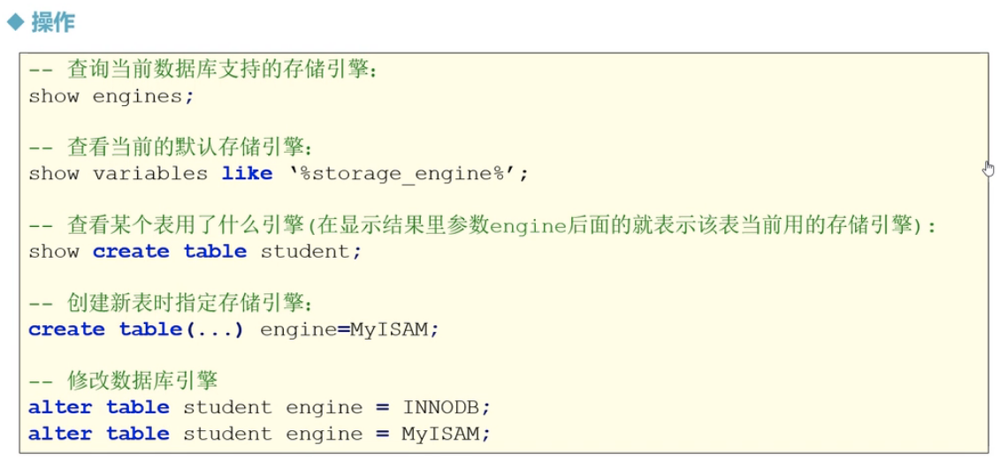
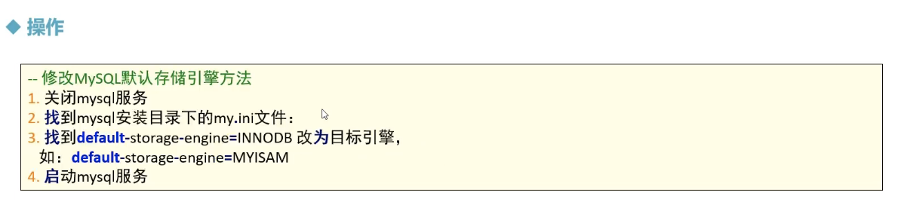

# MySQL 的存储引擎

## 存储引擎的概述







> 


## 存储引擎的操作



> ```sql
> -- 查看当前数据库支持的存储引擎 
> show ENGINES;
> 
> -- 查看当前默认的存储引擎
> show VARIABLES like '%storage_engine%';
> show VARIABLES like '%default_storage_engine%';
> 
> -- 查看某个表的创建语句/用了什么引擎
> use mydb5;
> show CREATE TABLE student;
> /*
> CREATE TABLE `student` (
>   `sid` int NOT NULL,
>   `card_id` varchar(20) DEFAULT NULL,
>   `gender` varchar(20) DEFAULT NULL,
>   `name` varchar(20) DEFAULT NULL,
>   `age` int DEFAULT NULL,
>   `birth` date DEFAULT NULL,
>   `phone_num` varchar(20) DEFAULT NULL,
>   `score` double DEFAULT NULL,
>   PRIMARY KEY (`sid`),
>   UNIQUE KEY `index_phone_name` (`phone_num`,`name`),
>   KEY `index_age` (`age`)
> ) ENGINE=InnoDB DEFAULT CHARSET=utf8mb4 COLLATE=utf8mb4_0900_ai_ci
> */
> -- 创建新表时指定存储引擎 
> CREATE TABLE if not EXISTS stu2(
> 	id int,
> 	name VARCHAR(20)
> ) ENGINE = myisam;
> -- 查看创建表时使用的存储引擎
> SHOW CREATE TABLE stu2;
> /*
> CREATE TABLE `stu2` (
>   `id` int DEFAULT NULL,
>   `name` varchar(20) DEFAULT NULL
> ) ENGINE=MyISAM DEFAULT CHARSET=utf8mb4 COLLATE=utf8mb4_0900_ai_ci
> */
> 
> -- 通过alter 命令来修改表的存储引擎 
> ALTER TABLE student ENGINE = myisam;
> SHOW CREATE TABLE student;
> /*
> CREATE TABLE `student` (
>   `sid` int NOT NULL,
>   `card_id` varchar(20) DEFAULT NULL,
>   `gender` varchar(20) DEFAULT NULL,
>   `name` varchar(20) DEFAULT NULL,
>   `age` int DEFAULT NULL,
>   `birth` date DEFAULT NULL,
>   `phone_num` varchar(20) DEFAULT NULL,
>   `score` double DEFAULT NULL,
>   PRIMARY KEY (`sid`),
>   UNIQUE KEY `index_phone_name` (`phone_num`,`name`),
>   KEY `index_age` (`age`)
> ) ENGINE=MyISAM DEFAULT CHARSET=utf8mb4 COLLATE=utf8mb4_0900_ai_ci
> */
> 
> ```




