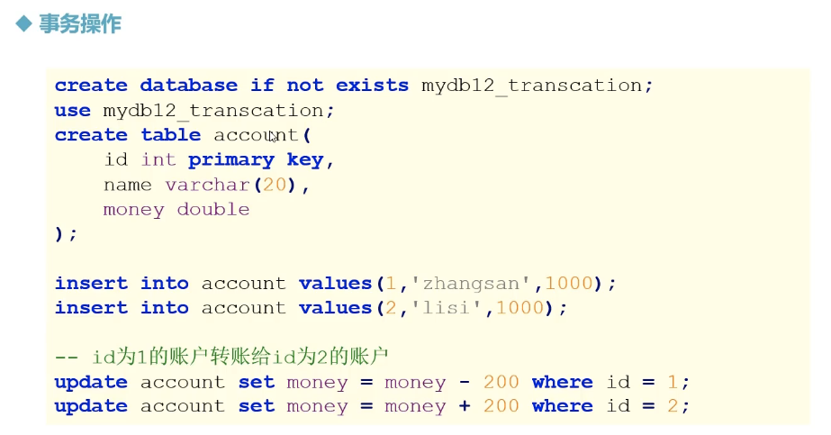

# MySQL --- 事务

---


## 事务操作


> 
>
> ```sql
> CREATE DATABASE if not EXISTS mydb2_transaction;
> use mydb2_transaction;
> 
> CREATE TABLE if not EXISTS account(
> 	id int PRIMARY KEY,
> 	name VARCHAR(20),
> 	money double 
> );
> 
> -- 插入数据 
> INSERT into account VALUES(1, 'allen', 1000);
> INSERT into account VALUES(2, 'jones', 1000);
> 
> 
> -- 需求： id为1 的账户转账给ID 为2的账户 
> 
> 	-- 设置mysql 的事务为手动提交（关闭自动提交 ）
> 	SELECT @@autocommit;
> 	set autocommint = 0;  # 禁止自动提交 
> 
> 	-- 模拟账户转账 
> 	-- 开启事务 	/ START TRANSACTION;
> BEGIN;
> UPDATE account set money = money  - 200 WHERE name = 'allen';
> UPDATE account set money = money + 200 where name = 'jones';
> -- 提交事务 
> COMMIT;
> 
> -- 回滚事务 
> ROLLBACK;
> 
> -- 这里可以查看最新的变化，但是数据库表中并没有更新，除非commit 
> SELECT * FROM account;
> ```
>
> 

## 事务的特性


> ACID:
>
> 原子性：atomicity， 不可分割性
>
> 一致性：consistency， 
>
> 隔离性： isolation 独立性 
>
> 持久性： durability


## 事务 -- 隔离级别


> **事务的隔离级别**：
>
> ​	- 两个事务之间的紧密程度
>
> 越向下，两事务关联程度越小，越稀疏；越向上关联程度越紧密
>
> > MySQL默认隔离级别为 repeatable read, 可重复读
> >
> > Oracle默认隔离级别为 read committed, 读提交
>
> 可序列化：效率较低


> 
>
> 

## 事务的隔离级别 -- 操作


> ```sql
> 	set autocommint = 0;  # 禁止自动提交 
> 	set autocommint = 1;  # 开启自动提交 
> 	
> ```
>
> >
> >
> >```sql
> >-- 读未提交 
> >set session transaction isolation level read uncommitted;
> >-- 会引起脏读，A事务会读取到B 事务还没有提交的数据 
> >
> >
> >-- 读已提交（不可重复读）
> >set session transaction isolation level read committed;
> >-- 这种隔离级别会引起不可重复读，A事务在没有提交事务期间，读到B事务的数据是不同的， 提交之前看到的数据不一致
> >
> >
> >-- 可重复读，repeatable read （mysql 默认的级别）
> >set session transaction isolation level repeatable read;
> >-- 这种隔离级别会引起幻读， A事务在提交之前和提交之后 看到的数据不一致
> >
> >
> >-- 序列化-- 串行化 serializable
> >set session transaction isolation level serializable;
> >-- 这种隔离级别比较安全，但是效率低，A 事务操作表的时候，表会被锁起来，B 事务不能操作
> >
> >
> >```
> >
> >


