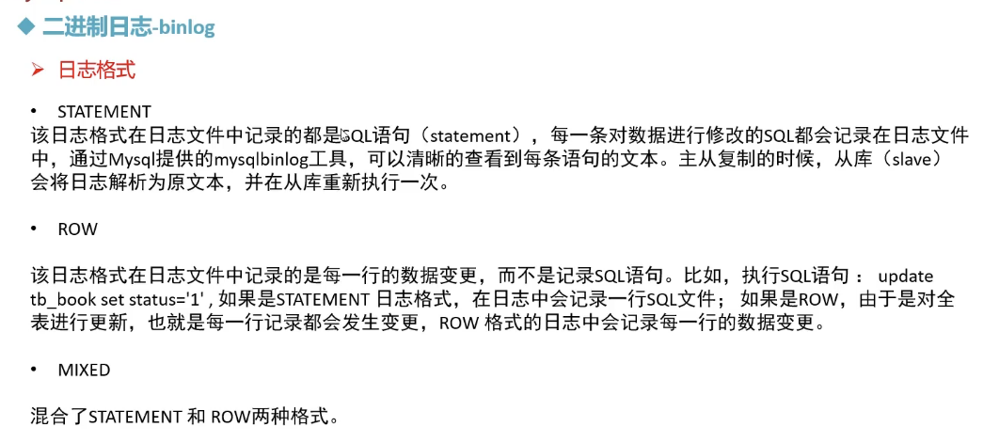

# MySQL的日志


## 错误日志 


> 


## 二进制日志


>```sql
>
>
>```



> ```sql
> 
> -- 查看mysql 是否开启 binlog 日志 
> SHOW VARIABLES like 'log_bin';  --  ON 
> 
> -- 查看binlog日志的默认格式
> SHOW VARIABLES like 'binlog_format';  -- row 
> 
> -- 查看所有日志 
> show binlog EVENTS;
> 
> -- 查看最新的日志 
> show master status;
> 
> -- 查询指定的binlog日志 
> show BINLOG EVENTS in 'binlog.000001';
> 
> 
> UPDATE mydb4.emp set salary = 1000;
> UPDATE mydb4.emp set salary = 1000;
> UPDATE mydb4.employee set ename = 'xaaaa';
> --  查询语句不会记录在日志中
> SELECT * from mydb4.emp;
> 
> -- 从指定位置开始，查看指定的binlog日志，限制查询的条数 
> show BINLOG EVENTS in 'binlog.000001' from 157 LIMIT 2;
> -- 从指定位置开始，带有偏移， 查看指定的binlog日志，限制查询的条数 
> show BINLOG EVENTS in 'binlog.000001' from 157 LIMIT 0,2;
> 
> 
> -- 清空所有的binlog日志文件 
> reset master;
> ```
>
> 

## 查询日志


>```sql
>-- 查看mysql 是否开启了查询日志 
>show VARIABLES LIKE 'general_log'; -- off 
>
>-- 开启查询日志， 这里是--暂时开启，query会话结束后，便失效了 
>set GLOBAL general_log =1;
>
>SELECT * from mydb4.orders;
>SELECT * from mydb4.emp;
>SELECT * from mydb5.student;
>SELECT count(*) from mydb5.stu2;
>UPDATE mydb4.employee set ename = 'bbbbb';
>```
>
>
>
>

## 慢查询日志


> ```sql
> -- 慢日志查询 
> -- 查看慢查询日志是否开启
> show VARIABLES like 'slow_query_log%'; -- off 
> 
> -- 开启慢查询日志 
> set GLOBAL slow_query_log =1;  -- on 
> 
> -- 查看慢查询日志的 超时时间, 默认为 10s 
> show VARIABLES like 'long_query_time%'; -- 10s
> 
> 
> SELECT SLEEP(10);
> 
> SELECT SLEEP(12);
> 
> ```
>
> 


