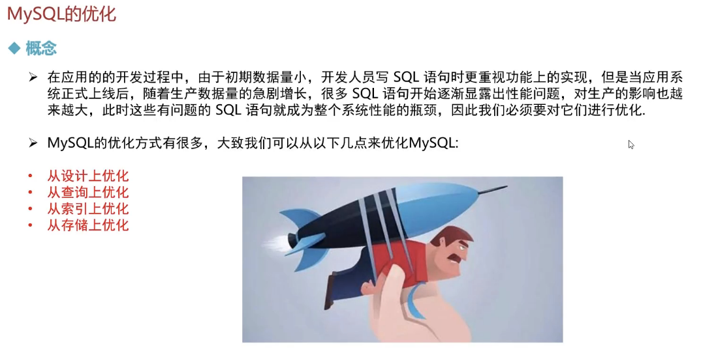
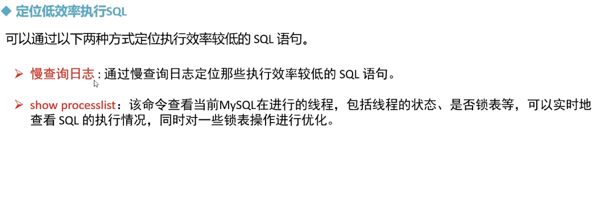
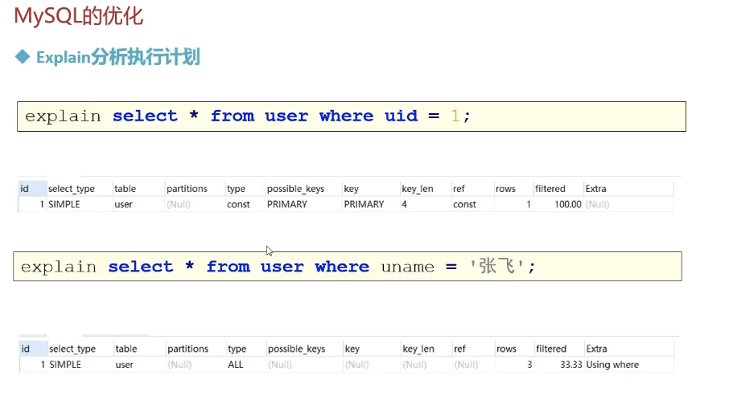
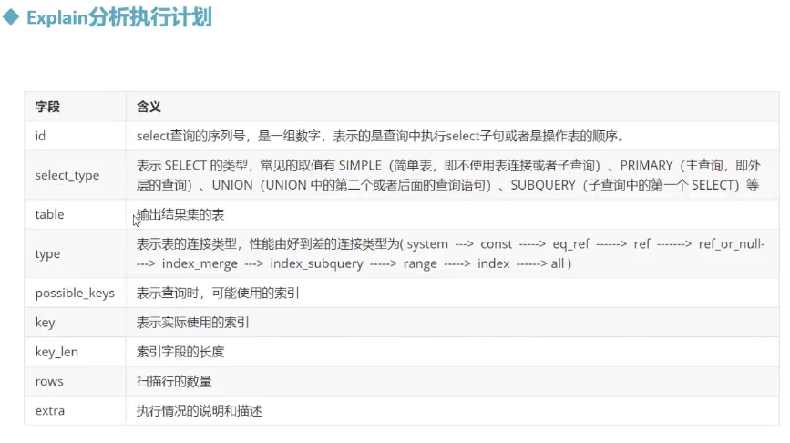

# MySQL 的优化 



## 优化 - 查看SQL执行效率


> 
>
> 
>
> 
>
> 
>
> 
>
> 


## 定位低效率执行 SQL 



----


> ```sql
> -- 定位低效率执行sql - 慢查询日志 
> -- 查看慢查询日志 配置信息 
> show VARIABLES like '%slow_query_log%'; -- on 
> 
> 
> -- 开启慢查询日志 
> set global slow_query_log = 1;
> 
> -- 查看慢查询日志记录sql 的最低阈值时间 -- 默认情况，sql执行时间>=10, 则为慢查询。会被记录到慢查询日志中去 
> show VARIABLES like 'long_query_time%';
> SELECT SLEEP(11),'hello world'; -- check 
> 
> 
> -- 修改慢查询日志记录sql的最低阈值时间 
> set GLOBAL long_query_time = 3;
> ```
>
> 

----


> ```sql
> -- 通过show PROCESSLIST 查看当前客户端连接服务器的线程执行状态信息 
> show PROCESSLIST;
> 
> SELECT SLEEP(50);
> ```


## explain 分析执行计划






>
>
>```sql
>-- --------EXPLAIN 执行计划 --------- 
>CREATE DATABASE if not EXISTS mydb13;
>use mydb13;
>
>
>-- -1.查询执行计划 
>EXPLAIN SELECT * from emp where empno = '1001';
>
>-- 2.查询执行计划 
>EXPLAIN SELECT * from emp where ename = 'scott';
>```
>
>

## explain 分析执行计划 - Explain 之 id


>
>
>

## explain 分析执行计划 - Explain 之  select_type


> 
>
> 

## explain 分析执行计划-Explain之type


>
>
>
>
>```sql
>-- const 
>EXPLAIN SELECT * from emp where empno = '1002';
>
>-- 添加唯一索引 
>CREATE UNIQUE index index_ename on emp(ename);
>EXPLAIN SELECT * from emp where ename= 'scott'; -- const
>drop index index_ename on emp; -- 删除索引 
>
>-- 添加普通索引 
>CREATE index index_ename on emp(ename);
>EXPLAIN SELECT * from emp where ename= 'scott';  -- type: ref
>```
>
>```sql
>-- er_ref 左表有主键， 而且左表的每一行和右表的每一行刚好匹配
>use mydb13;
>CREATE table if not EXISTS user2(
>	id int,
>	name VARCHAR(20)
>);
>INSERT into 
>	user2 
>values(1, 'allen'),(2,'jones'),(3,'hankin');
>
>CREATE TABLE if not EXISTS user2_ex(
>id int,
>	age int
>);
>INSERT into user2_ex values(1, 20),(2,21),(3,24);
>
>--  -------------
>EXPLAIN SELECT * from user2 a,user2_ex b where a.id = b.id;  -- ALL
>
>-- 给user2表添加主键索引 
>ALTER TABLE user2 add PRIMARY key(id);
>EXPLAIN SELECT * from user2 a,user2_ex b where a.id = b.id;  -- eq_ref 一对一
>
>--  在user2_ex 表中添加一个重复的行数据 
>EXPLAIN SELECT * from user2 a,user2_ex b where a.id = b.id;  -- ALL
>
>```
>
>```sql
>-- ref 
>-- 左表普通索引，和右表匹配的时，可能会匹配多行，
>-- 删除user2表的主键索引 
>ALTER TABLE user2 drop PRIMARY key;
>-- 给user2表添加普通索引 
>CREATE index index_id on user2(id);
>
>EXPLAIN SELECT * from user2 a,user2_ex b where a.id = b.id;  -- ref 
>
>```
>
>```sql
>-- range 范围查询 
>EXPLAIN SELECT * from user2 where id>2; -- range
>
>-- index : 把索引列的全部数据都扫描 
>EXPLAIN SELECT id from user2; -- index
>EXPLAIN SELECT * from user2; -- all
>```
>
>


##  explain分析执行计划-其他指标字段


> ```sql
> EXPLAIN SELECT * from emp order by ename;  -- Using filesort
> 
> EXPLAIN SELECT COUNT(1) from emp GROUP BY mgr;  -- Using temporary
> 
> EXPLAIN SELECT empno,COUNT(1) from emp GROUP BY empno;  -- Using index
> ```
>
> 


## show profile 分析 SQL


>
>
>```sql
>
>
>-- 查看当前的mysql是否支持profile
>SELECT @@have_profiling;
>-- 如果不支持，则需要设置打开 
>set profiling =1;
>
>-- 执行sql
>SHOW DATABASES;
>use mydb13;
>show tables;
>SELECT count(*) from emp;
>SELECT * from emp where sal>1000;
>
>
>SHOW PROFILES;
>```
>
>


>```sql
>SHOW PROFILE for QUERY 21;
>```
>
>


## trace 分析优化器执行计划 


## MySQL优化 - 索引优化


### 1. ------

> 
>
> ```sql
> 
> --  创建组合索引
> create index idx_seller_name_sta_addr on tb_seller(name, status, address);
> 
> -- 全值匹配，和字段匹配成功即可，和字段无关
> explain select * from tb_seller where name = '小米科技' and status ='1' and address = '北京市';
> explain select * from tb_seller where address = '北京市' and name = '小米科技' and status ='1';
> ```

### 2. ------

> 
>
> 
>
> ```sql
> -- 最左前缀法则
> -- 如果索引了多个列，要遵守最左前缀法则。指的是查询从索引的最左前列开始，并且不跳过索引中的列
> explain select * from tb_seller where name = '小米科技';
> explain select * from tb_seller where name = '小米科技' and status ='1';
> explain select * from tb_seller where status ='1' and name = '小米科技' 
> 
> -- 违背最左前缀法则，索引失效
> explain select * from tb_seller where status ='1'; -- null 不能使用组合索引 
> 
> -- 如果符合最左法则，但是出现跳跃某一列，只有最左列索引生效。
> explain select * from tb_seller where name = '小米科技' and address = '北京市';
> 
> ```

### 3. ------

> 
>
> ```sql
> -- 范围查询右边的列，不能使用索引 
> -- 根据前面的两个字段name，status查询是走索引的，但是最后一个条件address 没有用到索引。 
> explain select * from tb_seller where name = '小米科技' and status >'1' and address = '北京市';
> 
> -- 不要在索引列上进行运算操作，索引将失效
> explain select * from tb_seller where substring(name,3,2) = '科技';
> 
> -- 字符串不加单引号，会造成索引失效 
> explain select * from tb_seller where status =1; 
> 
> 
> ```

> 
>
>```sql
>-- 尽量使用覆盖索引，避免使用 select * 
>-- 需要从原表（磁盘）上读取数据，效率低
>explain select * from tb_seller where name = '小米科技' and address = '北京市'; 
>-- extra：using index condition 这些数据查找，既要找索引，有需要从原表中搜索查找
>
>
>-- 从索引树中就可以查找到所有的数据
>explain select name from tb_seller where name = '小米科技' and address = '北京市'; 
>explain select name,status, address from tb_seller where name = '小米科技' and address = '北京市'; 
>
>-- 效率低
>explain select name,status, address, password from tb_seller where name = '小米科技' and address = '北京市'; 
>
>
>```
>
>
>
>
>
>```sql
>explain select name from tb_seller where name = '黑马程序员' or createtime = '2088-01-01 12:00:00';
>-- 两个都不会用到索引 
>
>
>explain select name from tb_seller where name = '黑马程序员' or address = '西安市';
>-- 前面有索引or 后面有索引，依然没有索引被使用 
>
>
>```
>
>```sql
>-- 以%开头的like模糊查询，索引失效
>explain select * from tb_seller where name like '科技%';  -- 用索引
>explain select * from tb_seller where name like '%科技';  -- 不用索引
>explain select * from tb_seller where name like '%科技%';  -- 不用索引
>
>
>-- 弥补不足, 不用*， 使用索引列，
>explain select name from tb_seller where name like '%科技%';  -- using where, using index
>
>```

> 

## MySQL优化 - SQL优化

### 1.sql优化 - 大批量插入优化


> ```sql
> -- 1.首先，检查一个全局系统变量‘local_infile’的状态。 
> -- 如果显示value = off，则说明不可用， 
> show GLOBAL VARIABLES like 'local_infile';
> 
> -- 2. 修改local_infile值为on， 开启local_infile 
> set GLOBAL local_infile =1;
> 
> -- 3,加载数据
> -- 结论： 当通过load向表中加载数据时， 尽量保证文件中的主键有序，这样可以提高执行效率
> 
> 
> truncate table tb_user;
> -- 主键有序 22s
> -- 主键无序 81s
> 
> 
> 
> ```
>
> 
>
> 


> ```sql
> -- 关闭唯一性校验
> -- 时间消耗 21s
> 
> ```
>
> 

----


### 2.优化insert语句


---


### 3.order-by优化


> 
>
>


> ```sql
> show VARIABLES like 'max_length_for_sort_data';
> show VARIABLES like 'sort_buffer_size';
> 
> 
> 
> ```

----


### 4.子查询优化


---

### 5. 优化limit查询 


>1.
>
>
>
>2.
>
>
>
>

