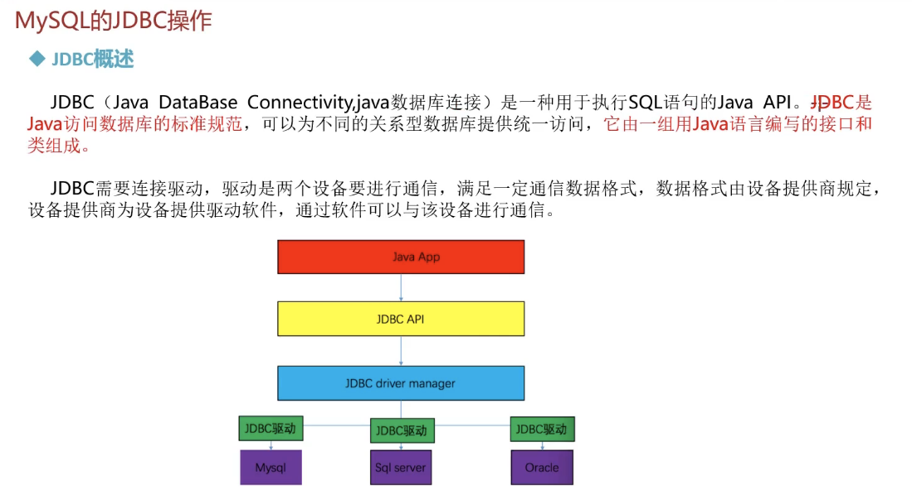
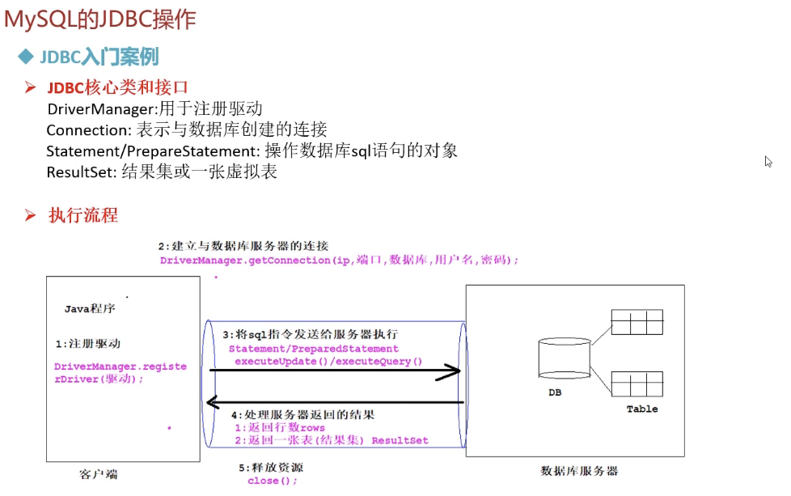
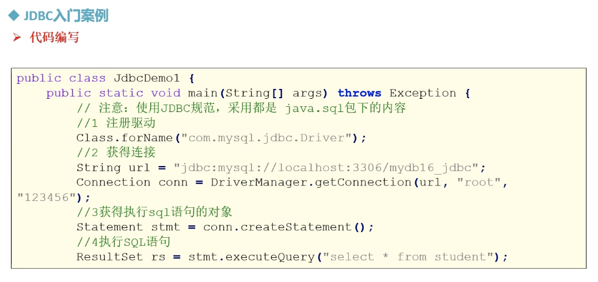
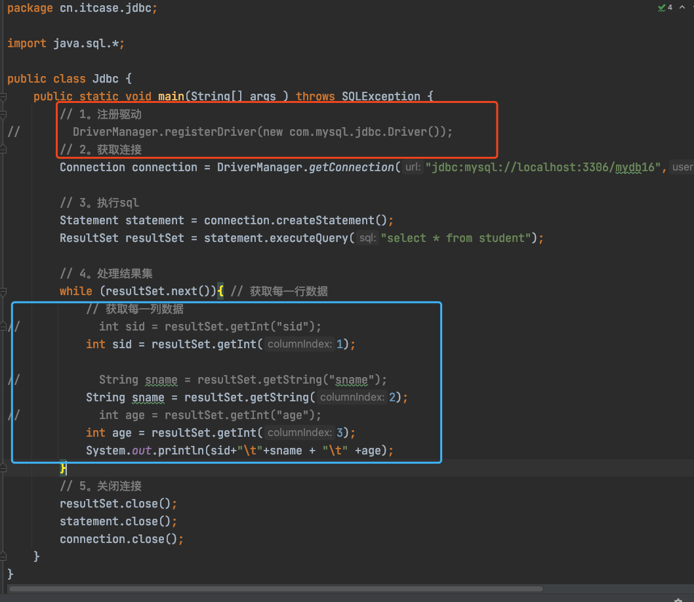
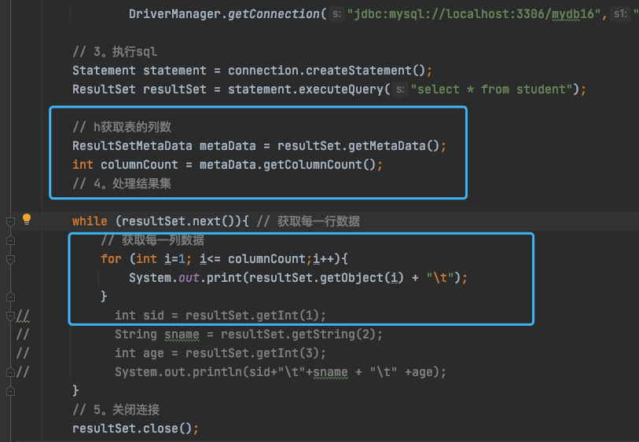
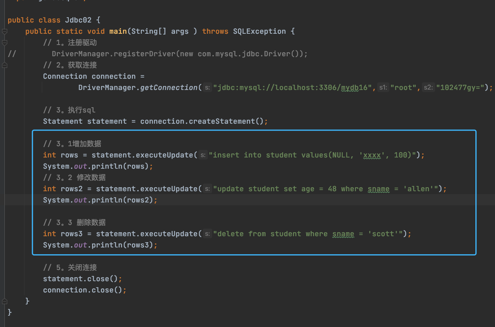
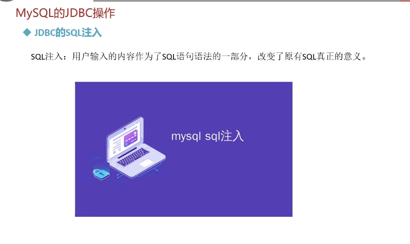
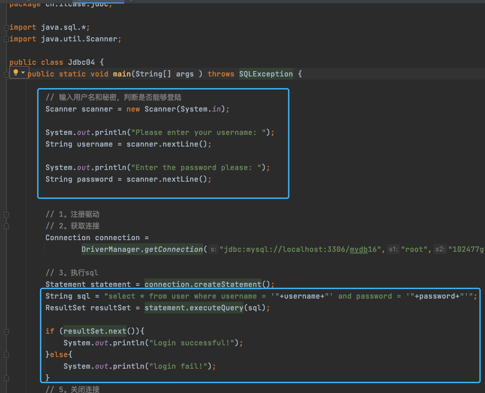
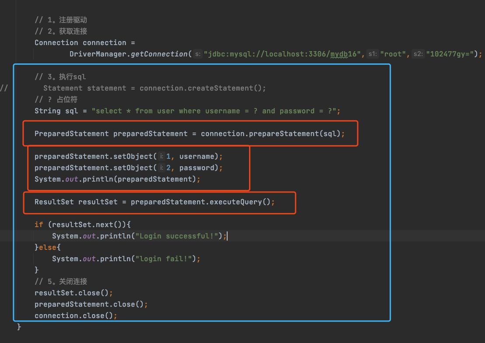

# MySQL 的 JDBC操作





## JDBC 代码的实现



> ```sql
> drop DATABASE if EXISTS mydb16;
>  
>  CREATE DATABASE if not EXISTS mydb16;
>  
>  use mydb16;
>  
>  CREATE table if not EXISTS student(
> 		sid int PRIMARY key auto_increment,
> 		sname VARCHAR(20),
> 		age int
>  );
>  
>  insert into student 
>  values (NULL, 'allen',30),
> 				(NULL,'jones',40),
> 				(NULL,'scott',20);
> ```
>
> 
>
> ```java
> package cn.itcase.jdbc;
> 
> import java.sql.*;
> 
> public class Jdbc {
>     public static void main(String[] args ) throws SQLException {
>         // 1。注册驱动
>         DriverManager.registerDriver(new com.mysql.jdbc.Driver());
>         // 2。获取连接
>         Connection connection = DriverManager.getConnection("jdbc:mysql://localhost:3306/mydb16","root","102477gy=");
> 
>         // 3。执行sql
>         Statement statement = connection.createStatement();
>         ResultSet resultSet = statement.executeQuery("select * from student");
> 
>         // 4。处理结果集
>         while (resultSet.next()){ // 获取每一行数据
>             // 获取每一列数据
>             int sid = resultSet.getInt("sid");
>             String sname = resultSet.getString("sname");
>             int age = resultSet.getInt("age");
>             System.out.println(sid+"\t"+sname + "\t" +age);
>         }
>         // 5。关闭连接
>         resultSet.close();
>         statement.close();
>         connection.close();
>     }
> }
> 
> ```
>
> 

## jdbc结果集优化 

> 


## jdbc-增删改操作




## jdbc -  SQL注入



>```sql
>-- sql注入 
>DROP TABLE if EXISTS user;
>CREATE TABLE if not EXISTS user(
>	uid int PRIMARY KEY auto_increment,
>	username VARCHAR(20),
>	password VARCHAR(20)
>);
>INSERT into user VALUES(NULL, 'allen', '123456'),
>											(NULL, 'jjj', '99999');
>```
>
>
>
>
>
>

> 


