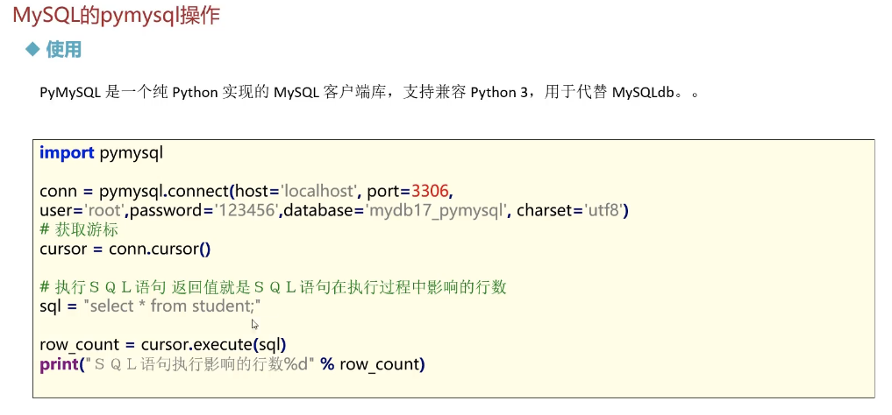
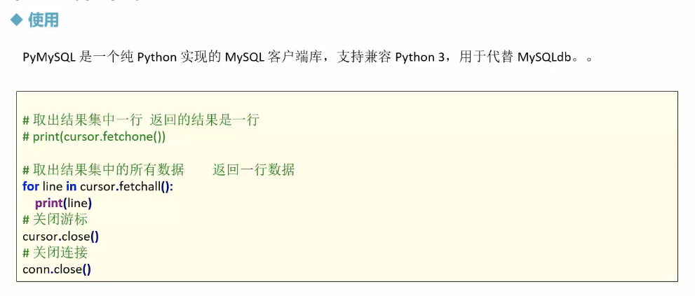

# mysql的pymsql操作

## 使用



>```python
>import pymysql
>
># 获取mysql连接
>conn = pymysql.connect(
>    host='localhost',
>    port=3306,
>    user='root',
>    password='102477gy=',
>    database='mydb16',
>    charset='utf8'
>)
>
># 获取游标
>cursor = conn.cursor()
>
># 执行sql语句， 返回值就是sql语句在执行过程中影响的行数
>
>sql = "select * from student"
>
>row_count =cursor.execute(sql)
>print('sql 语句执行影响的行数 %d' % row_count)
>
># 取出结果集中的一行，返回的结果是一行
># print(cursor.fetchone())
>cursor.fetchone()
>
># 取出结果集中的所有的数据， 返回一行数据
>for line in cursor.fetchall():
>    print(line)
>
># 关闭游标
>cursor.close()
>```
>
>



>```python
>import pymysql
># 获取mysql连接
>conn = pymysql.connect(
>    host='localhost',
>    port=3306,
>    user='root',
>    password='102477gy=',
>    database='mydb16',
>    charset='utf8'
>)
>
># 获取游标
>cursor = conn.cursor()
>
># 插入数据
># sql = "insert into student values(%s, %s,%s)"
># data = (5,'bbbb',100)
># cursor.execute(sql, data)
>
># 修改数据
># sql = "update student set sname=%s where sid=%s"
># data = ('hankin', 4)
># cursor.execute(sql, data)
># 删除数据
>sql = "delete  from student where sid=%s"
>data = (4)
>cursor.execute(sql, data)
>
>print("提交成功")
>conn.commit() # 提交，不然无法保存插入或者修改的数据（）
># 关闭游标
>cursor.close()
>
># 关闭连接
>conn.close()
>```
>
>
>
>


